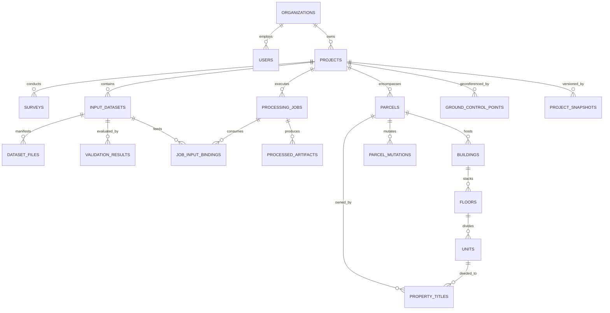

# NAKSHA 2.0 — DATABASE & STORAGE ARCHITECTURE
**Hybrid Relational-Spatial (PostgreSQL + PostGIS) & Distributed Object Storage (MinIO / S3) Design**  
**Document Status:** FROZEN (Phase 2)  
**Parent Specifications:**  
- [NAKSHA_2.0_DATA_SPECIFICATION.md](file:///d:/surveynaksha/NAKSHA_2.0_DATA_SPECIFICATION.md) (Data Categories & Ingestion)  
- [NAKSHA_2.0_REQUIREMENT_ENGINE.md](file:///d:/surveynaksha/NAKSHA_2.0_REQUIREMENT_ENGINE.md) (Pre-Flight Validation & Quality Profiling)  

---

## 1. Storage Architecture Overview

Naksha 2.0 employs a strict separation of concerns across four tier architectures:
1. **Spatial & Relational Database (PostgreSQL 16+ with PostGIS 3.4+):** Relational integrity, spatial vector topology, 3D cadastral hierarchies (LADM ISO 19152), geodetic coordinates, jobs, and pre-flight validation records.
2. **Distributed Object Storage (MinIO / AWS S3 Compatible):** High-throughput, immutable object storage for multi-gigabyte raw payloads (LAS, TIFF, RAW, IFC) and pyramid-tiled stream caches (COPC, COG, 3D Tiles, MVTs).
3. **Metadata & Manifest Storage:** Fast JSONB indexing and queryable attributes embedded inside PostgreSQL with synchronized spatial bounds.
4. **Versioned Project History:** Temporal table versioning (`tstzrange`) and snapshot commit lineage tracking every parcel mutation, split, and boundary adjustment.

```
┌────────────────────────────────────────────────────────────────────────────────────────┐
│                               NAKSHA 2.0 STORAGE FABRIC                                │
│                                                                                        │
│   ┌─────────────────────────────────────────┐  ┌────────────────────────────────────┐  │
│   │   POSTGRESQL 16 + POSTGIS 3.4           │  │   MINIO / S3 OBJECT STORAGE        │  │
│   ├─────────────────────────────────────────┤  ├────────────────────────────────────┤  │
│   │ • Projects, Users & RBAC                │  │ • Raw Sensor Payloads (UAV/LiDAR)  │  │
│   │ • Datasets, Files Manifest & Checksums  │  │   - .las, .laz, .e57, .raw, .tif   │  │
│   │ • Requirement Validation Results        │  │ • Cloud Optimized Rasters (COG)    │  │
│   │ • Asynchronous Processing Jobs          │  │ • Cloud Optimized Points (COPC)    │  │
│   │ • Ground Control Points (GCPs / CPs)    │  │ • 3D Tiles v1.1 & Potree Streams   │  │
│   │ • Parcels, ULPIN & Sub-divisions        │  │ • BIM IFC / GLTF / GLB 3D Meshes   │  │
│   │ • 3D Buildings, Floors & Units (LADM)   │  │ • Legal PDFs, Scanned Deeds, Deeds │  │
│   │ • Versioned Parcel Mutation Lineage     │  │ • Immutable Chunk Archives (.zip)  │  │
│   └─────────────────────────────────────────┘  └────────────────────────────────────┘  │
│                        │                                         │                     │
│                        └───────────────────┬─────────────────────┘                     │
│                                            │                                           │
│                              NAKSHA CORE INGESTION & PIPELINE                          │
└────────────────────────────────────────────────────────────────────────────────────────┘
```

---

## 2. Object Storage (MinIO / S3) Bucket Topology & Key Standards

### 2.1 Bucket Partitioning Strategy
To prevent single-bucket throttling, maintain lifecycle rules, and segregate confidential legal records from streaming tiles, storage is divided into four dedicated buckets:

| Bucket Name | Access Policy | Retention & Lifecycle | Contents |
|---|---|---|---|
| `naksha-raw-payloads` | Private (Presigned URLs only) | WORM / Glacier Archive after 90 days | Untouched original survey uploads (`.las`, `.jpg`, `.raw`, `.dwg`, `.ifc`, `.zip`) |
| `naksha-processed-artifacts`| Private (Internal Workers) | Standard Active Storage | Orthophoto GeoTIFFs, DTM/DSM rasters, vector geojson exports, CAD extractions |
| `naksha-streaming-tiles` | Public-Read / CDN Cached | Active NVMe Storage | Streamed COG overviews, COPC point octrees, 3D Tiles, Mapbox Vector Tiles (MVT) |
| `naksha-legal-documents` | Strictly Encrypted (SSE-KMS) | Immutable Legal Hold | 7/12 extracts, sale deeds, mutation orders, surveyor digital sign certificates |

### 2.2 Deterministic S3 Object Key Architecture
All object keys follow a deterministic hierarchical URI format:
```
{bucket}/
  projects/{project_id}/
    datasets/{dataset_id}/
      raw/{role}/{file_sha256}.{ext}
      derivatives/{artifact_type}/{variant_id}/...
      documents/{parcel_id}/{doc_sha256}.pdf
```

Example Key:
`naksha-raw-payloads/projects/prj_8f4a1/datasets/ds_photogrammetry_01/raw/primary/e3b0c44298fc1c149afbf4c8996fb924.jpg`

---

## 3. PostgreSQL + PostGIS Physical Database Design

### 3.1 Entity Relationship Architecture



---

## 4. Complete PostgreSQL + PostGIS DDL Implementation

Below is the production-ready DDL specification with PostGIS 3.4 extensions, domain constraints, spatial GIST indexes, and temporal audit fields.

```sql
-- ============================================================================
-- NAKSHA 2.0 CORE SCHEMA DDL
-- Target: PostgreSQL 16+ / PostGIS 3.4+
-- ============================================================================

-- 1. Enable Required Extensions
CREATE EXTENSION IF NOT EXISTS "uuid-ossp";
CREATE EXTENSION IF NOT EXISTS "postgis";
CREATE EXTENSION IF NOT EXISTS "postgis_raster";
CREATE EXTENSION IF NOT EXISTS "btree_gist";

-- ============================================================================
-- 2. Enumerated Domain Types
-- ============================================================================

CREATE TYPE user_role_enum AS ENUM (
    'SUPER_ADMIN',
    'SURVEY_DIRECTOR',
    'CHIEF_SURVEYOR',
    'GIS_ANALYST',
    'CADASTRAL_OFFICER',
    'QA_QC_ENGINEER',
    'FIELD_OPERATOR',
    'CLIENT_VIEWER'
);

CREATE TYPE accuracy_tier_enum AS ENUM (
    'TIER_1_CADASTRAL_LEGAL',    -- Horiz <= 2cm, Vert <= 3cm
    'TIER_2_ENGINEERING_GRADE',  -- Horiz <= 5cm, Vert <= 7cm
    'TIER_3_TOPOGRAPHIC_RECON'   -- Horiz <= 20cm, Vert <= 30cm
);

CREATE TYPE input_category_enum AS ENUM (
    'CAT_01_PHOTOGRAMMETRY',
    'CAT_02_LIDAR_POINT_CLOUD',
    'CAT_03_GIS_CAD',
    'CAT_04_GNSS_SURVEY',
    'CAT_05_DEM_ELEVATION',
    'CAT_06_ARCHITECTURAL_BIM',
    'CAT_07_PROPERTY_VERTICAL_DATA',
    'CAT_08_IMAGERY_ORTHOPHOTO',
    'CAT_09_PROJECT_METADATA',
    'CAT_10_SUPPORTING_DOCS'
);

CREATE TYPE dataset_status_enum AS ENUM (
    'STAGED',
    'VALIDATING',
    'BUNDLE_RESOLVED',
    'MISSING_COMPANION',
    'READY',
    'READY_WITH_WARNINGS',
    'BLOCKED',
    'FAILED'
);

CREATE TYPE job_status_enum AS ENUM (
    'QUEUED',
    'DISPATCHED',
    'RUNNING',
    'SUCCESS',
    'WARNING',
    'FAILED',
    'CANCELLED'
);

CREATE TYPE point_role_enum AS ENUM (
    'GCP_CONTROL',
    'CHECK_POINT',
    'BENCHMARK',
    'TRAVERSE_STATION',
    'BOUNDARY_MONUMENT'
);

CREATE TYPE land_use_enum AS ENUM (
    'AGRICULTURAL',
    'RESIDENTIAL',
    'COMMERCIAL',
    'INDUSTRIAL',
    'FOREST_CONSERVATION',
    'GOVERNMENT_PUBLIC',
    'WATER_BODY',
    'INFRASTRUCTURE_RIGHT_OF_WAY'
);

-- ============================================================================
-- 3. Core Identity, Tenancy & Organization
-- ============================================================================

CREATE TABLE organizations (
    id UUID PRIMARY KEY DEFAULT uuid_generate_v4(),
    slug VARCHAR(64) UNIQUE NOT NULL,
    legal_name VARCHAR(255) NOT NULL,
    license_type VARCHAR(64) NOT NULL DEFAULT 'ENTERPRISE',
    storage_quota_bytes BIGINT NOT NULL DEFAULT 5497558138880, -- 5 TB
    storage_used_bytes BIGINT NOT NULL DEFAULT 0,
    created_at TIMESTAMPTZ NOT NULL DEFAULT NOW(),
    updated_at TIMESTAMPTZ NOT NULL DEFAULT NOW()
);

CREATE TABLE users (
    id UUID PRIMARY KEY DEFAULT uuid_generate_v4(),
    organization_id UUID NOT NULL REFERENCES organizations(id) ON DELETE CASCADE,
    email VARCHAR(255) UNIQUE NOT NULL,
    password_hash VARCHAR(255) NOT NULL,
    full_name VARCHAR(128) NOT NULL,
    role user_role_enum NOT NULL DEFAULT 'FIELD_OPERATOR',
    license_number VARCHAR(128),
    digital_certificate_fingerprint VARCHAR(128),
    is_active BOOLEAN NOT NULL DEFAULT TRUE,
    created_at TIMESTAMPTZ NOT NULL DEFAULT NOW(),
    updated_at TIMESTAMPTZ NOT NULL DEFAULT NOW()
);

-- ============================================================================
-- 4. Projects & Surveys
-- ============================================================================

CREATE TABLE projects (
    id UUID PRIMARY KEY DEFAULT uuid_generate_v4(),
    organization_id UUID NOT NULL REFERENCES organizations(id) ON DELETE CASCADE,
    code VARCHAR(64) NOT NULL,
    title VARCHAR(255) NOT NULL,
    description TEXT,
    accuracy_tier accuracy_tier_enum NOT NULL DEFAULT 'TIER_1_CADASTRAL_LEGAL',
    target_crs_epsg INT NOT NULL DEFAULT 4326, -- e.g. 32643 (UTM Zone 43N)
    custom_crs_wkt TEXT,
    combined_scale_factor NUMERIC(10, 8) DEFAULT 1.00000000,
    -- Spatial Bounding Area of Interest (AOI)
    aoi_boundary GEOMETRY(Polygon, 4326),
    created_by UUID REFERENCES users(id),
    created_at TIMESTAMPTZ NOT NULL DEFAULT NOW(),
    updated_at TIMESTAMPTZ NOT NULL DEFAULT NOW(),
    CONSTRAINT uq_org_project_code UNIQUE (organization_id, code)
);

CREATE INDEX idx_projects_aoi ON projects USING GIST (aoi_boundary);

CREATE TABLE surveys (
    id UUID PRIMARY KEY DEFAULT uuid_generate_v4(),
    project_id UUID NOT NULL REFERENCES projects(id) ON DELETE CASCADE,
    survey_code VARCHAR(64) NOT NULL,
    survey_type VARCHAR(64) NOT NULL, -- 'UAV_PHOTOGRAMMETRY', 'AERIAL_LIDAR', 'DGPS_GROUND'
    lead_surveyor_id UUID REFERENCES users(id),
    weather_conditions JSONB,
    instruments_manifest JSONB, -- GNSS base/rover serials, drone models, total stations
    surveyed_from TIMESTAMPTZ NOT NULL,
    surveyed_to TIMESTAMPTZ,
    signoff_hash VARCHAR(128),
    created_at TIMESTAMPTZ NOT NULL DEFAULT NOW()
);

-- ============================================================================
-- 5. Datasets, Manifests & Storage Pointers
-- ============================================================================

CREATE TABLE input_datasets (
    id UUID PRIMARY KEY DEFAULT uuid_generate_v4(),
    project_id UUID NOT NULL REFERENCES projects(id) ON DELETE CASCADE,
    survey_id UUID REFERENCES surveys(id) ON DELETE SET NULL,
    category input_category_enum NOT NULL,
    name VARCHAR(255) NOT NULL,
    status dataset_status_enum NOT NULL DEFAULT 'STAGED',
    readiness_score NUMERIC(5, 2) DEFAULT 0.00, -- 0.00 to 100.00
    epsg_detected INT,
    crs_wkt TEXT,
    -- Spatial 3D Bounding Extent
    spatial_extent GEOMETRY(PolygonZ, 4326),
    temporal_start TIMESTAMPTZ,
    temporal_end TIMESTAMPTZ,
    total_size_bytes BIGINT NOT NULL DEFAULT 0,
    file_count INT NOT NULL DEFAULT 0,
    bundle_sha256 CHAR(64),
    metadata_manifest JSONB NOT NULL DEFAULT '{}'::jsonb,
    created_at TIMESTAMPTZ NOT NULL DEFAULT NOW(),
    updated_at TIMESTAMPTZ NOT NULL DEFAULT NOW()
);

CREATE INDEX idx_input_datasets_spatial ON input_datasets USING GIST (spatial_extent);
CREATE INDEX idx_input_datasets_category ON input_datasets(category);
CREATE INDEX idx_input_datasets_status ON input_datasets(status);

CREATE TABLE dataset_files (
    id UUID PRIMARY KEY DEFAULT uuid_generate_v4(),
    dataset_id UUID NOT NULL REFERENCES input_datasets(id) ON DELETE CASCADE,
    relative_path VARCHAR(512) NOT NULL,
    file_name VARCHAR(255) NOT NULL,
    extension VARCHAR(32) NOT NULL,
    file_role VARCHAR(64) NOT NULL, -- 'primary', 'companion_prj', 'companion_shx', 'flight_plan', 'trajectory'
    mime_type VARCHAR(128) NOT NULL,
    size_bytes BIGINT NOT NULL,
    sha256 CHAR(64) NOT NULL,
    -- Object Storage Reference
    s3_bucket VARCHAR(128) NOT NULL,
    s3_key VARCHAR(1024) NOT NULL,
    is_corrupt BOOLEAN NOT NULL DEFAULT FALSE,
    created_at TIMESTAMPTZ NOT NULL DEFAULT NOW()
);

CREATE INDEX idx_dataset_files_dataset_id ON dataset_files(dataset_id);
CREATE INDEX idx_dataset_files_s3_key ON dataset_files(s3_key);

-- ============================================================================
-- 6. Requirement Validation & Quality Engine Records
-- ============================================================================

CREATE TABLE validation_results (
    id UUID PRIMARY KEY DEFAULT uuid_generate_v4(),
    dataset_id UUID NOT NULL REFERENCES input_datasets(id) ON DELETE CASCADE,
    accuracy_tier_evaluated accuracy_tier_enum NOT NULL,
    verdict dataset_status_enum NOT NULL,
    readiness_score NUMERIC(5, 2) NOT NULL,
    -- Checklist Evaluation Snapshots
    required_passed BOOLEAN NOT NULL DEFAULT FALSE,
    required_checks JSONB NOT NULL DEFAULT '[]'::jsonb,
    recommended_checks JSONB NOT NULL DEFAULT '[]'::jsonb,
    -- Quantitative Quality Metrics
    quality_metrics JSONB NOT NULL DEFAULT '{}'::jsonb, 
    -- e.g. {"laplacian_blur_avg": 142.5, "overlap_forward_pct": 78.4, "point_density_sqm": 24.1}
    remediation_cards JSONB NOT NULL DEFAULT '[]'::jsonb,
    evaluated_at TIMESTAMPTZ NOT NULL DEFAULT NOW()
);

CREATE INDEX idx_validation_results_dataset_id ON validation_results(dataset_id);

-- ============================================================================
-- 7. Processing Pipeline & Asynchronous Job Scheduling
-- ============================================================================

CREATE TABLE processing_jobs (
    id UUID PRIMARY KEY DEFAULT uuid_generate_v4(),
    project_id UUID NOT NULL REFERENCES projects(id) ON DELETE CASCADE,
    pipeline_type VARCHAR(64) NOT NULL, -- 'SFM_PHOTOGRAMMETRY', 'LIDAR_BARE_EARTH', 'ORTHO_MOSAIC_COG', 'CONTOUR_GEN'
    status job_status_enum NOT NULL DEFAULT 'QUEUED',
    priority INT NOT NULL DEFAULT 5, -- 1 (Lowest) to 10 (Highest)
    progress_percentage NUMERIC(5, 2) DEFAULT 0.00,
    worker_node_id VARCHAR(128),
    parameters JSONB NOT NULL DEFAULT '{}'::jsonb,
    log_trace TEXT,
    error_summary TEXT,
    dispatched_at TIMESTAMPTZ,
    completed_at TIMESTAMPTZ,
    created_at TIMESTAMPTZ NOT NULL DEFAULT NOW(),
    updated_at TIMESTAMPTZ NOT NULL DEFAULT NOW()
);

CREATE TABLE job_input_bindings (
    job_id UUID NOT NULL REFERENCES processing_jobs(id) ON DELETE CASCADE,
    dataset_id UUID NOT NULL REFERENCES input_datasets(id) ON DELETE RESTRICT,
    PRIMARY KEY (job_id, dataset_id)
);

CREATE TABLE processed_artifacts (
    id UUID PRIMARY KEY DEFAULT uuid_generate_v4(),
    job_id UUID NOT NULL REFERENCES processing_jobs(id) ON DELETE CASCADE,
    project_id UUID NOT NULL REFERENCES projects(id) ON DELETE CASCADE,
    artifact_type VARCHAR(64) NOT NULL, -- 'COG_ORTHOPHOTO', 'COPC_LIDAR', '3D_TILES_MESH', 'DTM_GEOTIFF', 'MVT_VECTOR'
    s3_bucket VARCHAR(128) NOT NULL,
    s3_key VARCHAR(1024) NOT NULL,
    spatial_bounds GEOMETRY(PolygonZ, 4326),
    resolution_gsd_meters NUMERIC(8, 4),
    size_bytes BIGINT NOT NULL,
    stream_endpoint_url TEXT,
    created_at TIMESTAMPTZ NOT NULL DEFAULT NOW()
);

CREATE INDEX idx_processed_artifacts_bounds ON processed_artifacts USING GIST (spatial_bounds);

-- ============================================================================
-- 8. Geodetic Ground Control Points (GCPs / CPs)
-- ============================================================================

CREATE TABLE ground_control_points (
    id UUID PRIMARY KEY DEFAULT uuid_generate_v4(),
    project_id UUID NOT NULL REFERENCES projects(id) ON DELETE CASCADE,
    survey_id UUID REFERENCES surveys(id) ON DELETE SET NULL,
    point_identifier VARCHAR(64) NOT NULL, -- e.g. "GCP_01", "CP_04"
    role point_role_enum NOT NULL DEFAULT 'GCP_CONTROL',
    -- High Precision Coordinates (WGS84 3D)
    geom GEOMETRY(PointZ, 4326) NOT NULL,
    -- Projected Coordinates (e.g. UTM Easting, Northing, Orthometric Height)
    projected_x NUMERIC(14, 4) NOT NULL,
    projected_y NUMERIC(14, 4) NOT NULL,
    projected_z NUMERIC(10, 4) NOT NULL,
    sigma_x NUMERIC(8, 4), -- 1-sigma positional uncertainty in meters
    sigma_y NUMERIC(8, 4),
    sigma_z NUMERIC(8, 4),
    is_active BOOLEAN NOT NULL DEFAULT TRUE,
    field_photo_s3_key VARCHAR(1024),
    created_at TIMESTAMPTZ NOT NULL DEFAULT NOW(),
    CONSTRAINT uq_proj_point_id UNIQUE (project_id, point_identifier)
);

CREATE INDEX idx_gcps_geom ON ground_control_points USING GIST (geom);

-- ============================================================================
-- 9. Cadastral Fabric, ULPIN & 3D Property Hierarchy (LADM ISO 19152)
-- ============================================================================

-- Level 1: Surface Land Parcels (2D / 2.5D Polygons)
CREATE TABLE parcels (
    id UUID PRIMARY KEY DEFAULT uuid_generate_v4(),
    project_id UUID NOT NULL REFERENCES projects(id) ON DELETE CASCADE,
    -- Unique Land Parcel Identification Number (Bhu-Aadhaar in India)
    ulpin VARCHAR(32) UNIQUE,
    state_code VARCHAR(4) NOT NULL,
    district_code VARCHAR(8) NOT NULL,
    taluka_code VARCHAR(8) NOT NULL,
    village_code VARCHAR(16) NOT NULL,
    survey_number VARCHAR(64) NOT NULL, -- Official Revenue Survey / Khasra No
    sub_division_number VARCHAR(32),   -- Hissa / Gat No
    land_use land_use_enum NOT NULL DEFAULT 'AGRICULTURAL',
    legal_recorded_area_sqm NUMERIC(14, 4) NOT NULL,
    gis_computed_area_sqm NUMERIC(14, 4),
    area_delta_percentage NUMERIC(6, 3), -- Area discrepancy percentage
    -- Spatial Boundaries: PolygonZ with elevation profile
    geom GEOMETRY(MultiPolygonZ, 4326) NOT NULL,
    -- Temporal Range for Cadastral Mutations (System Versioning)
    valid_during TSTZRANGE NOT NULL DEFAULT TSTZRANGE(NOW(), NULL, '[)'),
    created_at TIMESTAMPTZ NOT NULL DEFAULT NOW(),
    updated_at TIMESTAMPTZ NOT NULL DEFAULT NOW()
);

CREATE INDEX idx_parcels_geom ON parcels USING GIST (geom);
CREATE INDEX idx_parcels_ulpin ON parcels (ulpin);
CREATE INDEX idx_parcels_temporal ON parcels USING GIST (valid_during);

-- Level 2: 3D Architectural / Built Structures on Parcel
CREATE TABLE buildings (
    id UUID PRIMARY KEY DEFAULT uuid_generate_v4(),
    parcel_id UUID NOT NULL REFERENCES parcels(id) ON DELETE CASCADE,
    building_code VARCHAR(64) NOT NULL,
    building_name VARCHAR(255),
    structure_type VARCHAR(64) NOT NULL DEFAULT 'RCC_RESIDENTIAL',
    floors_above_ground INT NOT NULL DEFAULT 1,
    floors_below_ground INT NOT NULL DEFAULT 0,
    ground_elevation_z NUMERIC(10, 3) NOT NULL,
    building_height_meters NUMERIC(8, 3) NOT NULL,
    bim_ifc_guid VARCHAR(64),
    -- Footprint or 3D Polyhedral Envelope
    footprint_geom GEOMETRY(MultiPolygonZ, 4326) NOT NULL,
    mesh_volume_geom GEOMETRY(PolyhedralSurfaceZ, 4326),
    created_at TIMESTAMPTZ NOT NULL DEFAULT NOW()
);

CREATE INDEX idx_buildings_footprint ON buildings USING GIST (footprint_geom);

-- Level 3: Vertical Storeys & Floors
CREATE TABLE floors (
    id UUID PRIMARY KEY DEFAULT uuid_generate_v4(),
    building_id UUID NOT NULL REFERENCES buildings(id) ON DELETE CASCADE,
    floor_number INT NOT NULL, -- 0 for Ground, 1 for First Floor, -1 for Basement
    floor_label VARCHAR(32) NOT NULL, -- "Ground Floor", "1st Floor", "Terrace"
    elevation_min_z NUMERIC(10, 3) NOT NULL,
    elevation_max_z NUMERIC(10, 3) NOT NULL,
    footprint_geom GEOMETRY(MultiPolygonZ, 4326),
    created_at TIMESTAMPTZ NOT NULL DEFAULT NOW(),
    CONSTRAINT uq_bldg_floor UNIQUE (building_id, floor_number)
);

CREATE INDEX idx_floors_geom ON floors USING GIST (footprint_geom);

-- Level 4: 3D Units, Apartments, Commercial Spaces (3D Cadastre)
CREATE TABLE units (
    id UUID PRIMARY KEY DEFAULT uuid_generate_v4(),
    floor_id UUID NOT NULL REFERENCES floors(id) ON DELETE CASCADE,
    unit_number VARCHAR(64) NOT NULL, -- e.g. "Flat 402", "Shop 12"
    unit_type VARCHAR(64) NOT NULL DEFAULT 'RESIDENTIAL_FLAT',
    carpet_area_sqm NUMERIC(10, 4) NOT NULL,
    built_up_area_sqm NUMERIC(10, 4) NOT NULL,
    undivided_land_share_pct NUMERIC(6, 4), -- Fractional share of parent parcel
    -- 3D Extruded Polyhedral Space
    solid_volume_geom GEOMETRY(PolyhedralSurfaceZ, 4326),
    created_at TIMESTAMPTZ NOT NULL DEFAULT NOW(),
    CONSTRAINT uq_floor_unit UNIQUE (floor_id, unit_number)
);

CREATE INDEX idx_units_solid ON units USING GIST (solid_volume_geom);

-- ============================================================================
-- 10. Title Deeds, Ownership Records & Legal Encumbrances
-- ============================================================================

CREATE TABLE property_titles (
    id UUID PRIMARY KEY DEFAULT uuid_generate_v4(),
    parcel_id UUID REFERENCES parcels(id) ON DELETE CASCADE,
    unit_id UUID REFERENCES units(id) ON DELETE CASCADE,
    owner_name VARCHAR(255) NOT NULL,
    owner_identity_hash VARCHAR(128) NOT NULL, -- SHA-256 of Aadhaar / Tax ID
    ownership_share_fraction NUMERIC(6, 5) NOT NULL DEFAULT 1.00000, -- 1.0 = Sole Owner, 0.5 = 50%
    tenure_type VARCHAR(64) NOT NULL DEFAULT 'FREEHOLD',
    registered_deed_number VARCHAR(128),
    deed_registration_date DATE,
    encumbrance_status VARCHAR(64) NOT NULL DEFAULT 'CLEAR',
    deed_document_s3_key VARCHAR(1024),
    created_at TIMESTAMPTZ NOT NULL DEFAULT NOW(),
    updated_at TIMESTAMPTZ NOT NULL DEFAULT NOW(),
    CONSTRAINT chk_title_target CHECK (
        (parcel_id IS NOT NULL AND unit_id IS NULL) OR
        (parcel_id IS NULL AND unit_id IS NOT NULL)
    )
);

CREATE INDEX idx_property_titles_parcel ON property_titles(parcel_id);
CREATE INDEX idx_property_titles_unit ON property_titles(unit_id);

-- ============================================================================
-- 11. Versioned Lineage & Historical Project Revisions
-- ============================================================================

CREATE TABLE project_snapshots (
    id UUID PRIMARY KEY DEFAULT uuid_generate_v4(),
    project_id UUID NOT NULL REFERENCES projects(id) ON DELETE CASCADE,
    parent_snapshot_id UUID REFERENCES project_snapshots(id),
    revision_number INT NOT NULL,
    commit_message TEXT NOT NULL,
    author_id UUID REFERENCES users(id),
    -- Cryptographic Manifest Hash of State
    state_tree_hash CHAR(64) NOT NULL,
    parcels_snapshot_manifest JSONB NOT NULL DEFAULT '{}'::jsonb,
    created_at TIMESTAMPTZ NOT NULL DEFAULT NOW()
);

CREATE TABLE parcel_mutations (
    id UUID PRIMARY KEY DEFAULT uuid_generate_v4(),
    project_id UUID NOT NULL REFERENCES projects(id) ON DELETE CASCADE,
    mutation_type VARCHAR(64) NOT NULL, -- 'SUBDIVISION_SPLIT', 'AMALGAMATION_MERGE', 'BOUNDARY_RECTIFICATION'
    sanction_order_number VARCHAR(128) NOT NULL,
    sanction_date DATE NOT NULL,
    parent_parcel_ids UUID[] NOT NULL,
    derived_parcel_ids UUID[] NOT NULL,
    approving_officer_id UUID REFERENCES users(id),
    mutation_deed_s3_key VARCHAR(1024),
    created_at TIMESTAMPTZ NOT NULL DEFAULT NOW()
);

-- ============================================================================
-- 12. Automated Triggers for Spatial Integrity & Timestamps
-- ============================================================================

-- Function: Compute GIS Area & Validate Area Delta on Parcel Update
CREATE OR REPLACE FUNCTION trg_calculate_parcel_gis_area()
RETURNS TRIGGER AS $$
BEGIN
    -- Calculate planar / ellipsoidal area in square meters using geography cast
    NEW.gis_computed_area_sqm := ST_Area(NEW.geom::geography);
    
    -- Calculate discrepancy percentage if legal area is positive
    IF NEW.legal_recorded_area_sqm > 0 THEN
        NEW.area_delta_percentage := ROUND(
            (ABS(NEW.gis_computed_area_sqm - NEW.legal_recorded_area_sqm) / NEW.legal_recorded_area_sqm * 100.0),
            3
        );
    END IF;
    
    NEW.updated_at := NOW();
    RETURN NEW;
END;
$$ LANGUAGE plpgsql;

CREATE TRIGGER trg_parcels_area_calc
BEFORE INSERT OR UPDATE ON parcels
FOR EACH ROW
EXECUTE FUNCTION trg_calculate_parcel_gis_area();
```

---

## 5. Storage Tier Interaction Contract

```
┌────────────────────────────────────────────────────────────────────────┐
│                        DATA ACCESS WORKFLOW MATRIX                     │
├──────────────────────────┬──────────────────────┬──────────────────────┤
│ Operation                │ Primary Storage Tier │ Protocol / Driver    │
├──────────────────────────┼──────────────────────┼──────────────────────┤
│ Spatial Envelope Queries │ PostgreSQL (PostGIS) │ SQL / GIST Index     │
│ Parcel Join & ULPIN Look │ PostgreSQL           │ B-Tree Primary Key   │
│ Raw Image / LAS Upload   │ MinIO / S3           │ S3 Multipart Upload  │
│ 3D Point Cloud Streaming │ MinIO / S3           │ HTTP Range (COPC)    │
│ Web Map Vector Tile (MVT)│ PostgreSQL (ST_MVT)  │ Dynamic ST_AsMVT SQL │
│ Orthophoto Basemap Pan   │ MinIO / S3           │ HTTP Range (COG)     │
│ Legal Deed PDF Retrieval │ MinIO / S3 (Legal)   │ S3 Presigned Get URL │
│ Parcel Mutation Rollback │ PostgreSQL (Temporal)│ AS OF TSTZRANGE      │
└──────────────────────────┴──────────────────────┴──────────────────────┘
```

---

## 6. Implementation Readiness & Phase Gate

This architecture is **FROZEN** as the physical database foundation for:
- Phase 3: [NAKSHA_2.0_PROJECT_STRUCTURE.md](file:///d:/surveynaksha/NAKSHA_2.0_PROJECT_STRUCTURE.md) (Physical Layout & 10 Input Types Virtualization)
- Phase 4: [NAKSHA_2.0_DESKTOP_SHELL.md](file:///d:/surveynaksha/NAKSHA_2.0_DESKTOP_SHELL.md) (Tauri, React, Tailwind, MapLibre, Three.js, FastAPI & Celery Shell)
- Phase 5: Processing Pipeline Orchestrator & Field QA Engine

