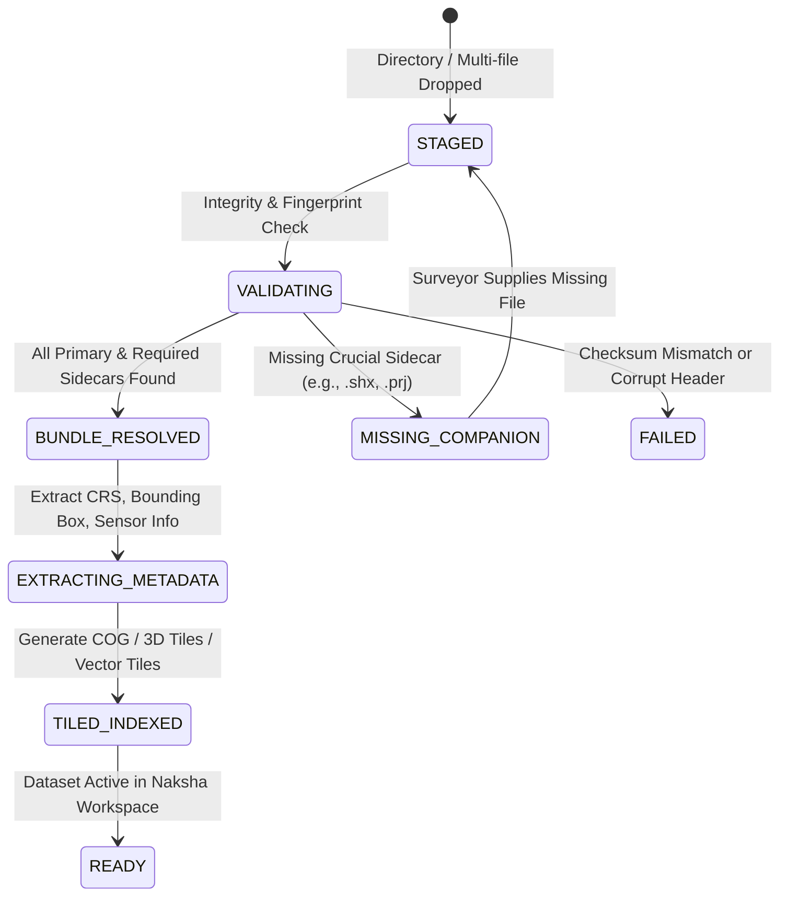

# NAKSHA 2.0 — DATA SPECIFICATION
**Standard Specification for Geospatial, Survey, CAD, BIM, and Land Records Ingestion**  
**Document Status:** FROZEN (Phase 0)  
**Target Platform:** Naksha 2.0 Land Survey, Geospatial Mapping, and Cadastral Intelligence Engine  

---

## 1. Executive Summary & Core Paradigm

In land survey, infrastructure modeling, and cadastral workflows, **a data category is virtually never a single disconnected file**. A survey project is composed of heterogeneous sensor outputs, spatial sidecars, camera calibrations, spatial vector topologies, property deeds, and elevation grids.

```
┌────────────────────────────────────────────────────────────────────────┐
│                        NAKSHA 2.0 DATASET PARADIGM                    │
│                                                                        │
│   ❌ INCORRECT:   1 Uploaded File   ==   1 Dataset                      │
│   ✅ CORRECT:     1 Logical Dataset ==   [ Primary Payload(s)          │
│                                           + Spatial Reference (.prj)   │
│                                           + Metadata/Sidecars (.json)  │
│                                           + Trajectory/Logs (.csv)     │
│                                           + Calibration Profiles ]     │
└────────────────────────────────────────────────────────────────────────┘
```

The Naksha 2.0 Ingestion Subsystem operates at the **Dataset Entity Level**. The system accepts directory trees, archive bundles (.zip, .tar), multi-file batch selections, or cloud bucket references, automatically fingerprinting and binding correlated files into a coherent, queryable, and processable unit.

---

## 2. Dataset Entity & Manifest Architecture

Every ingested dataset across all 10 categories conforms to the canonical `NakshaDataset` contract.

### 2.1 The Canonical Dataset Model
```typescript
interface NakshaDataset {
  id: string;                          // UUID v4
  projectId: string;                   // Parent project reference
  category: NakshaInputCategory;       // One of the 10 defined categories
  name: string;                        // Human-readable dataset name
  slug: string;                        // URL/filesystem-safe identifier
  status: DatasetIngestionStatus;      // DRAFT | STAGED | VALIDATING | READY | DEGRADED | FAILED
  crs: CoordinateReferenceSystem;      // EPSG code, WKT, or Local Grid definition
  spatialExtent: BoundingBox3D;        // [minX, minY, minZ, maxX, maxY, maxZ]
  temporalExtent?: [string, string];   // ISO 8601 Survey Start & End timestamps
  files: DatasetFileItem[];            // Comprehensive file manifest
  companionRoles: Record<string, string>; // Maps roles (e.g., "flight_plan", "camera_calibration") to file IDs
  metadata: Record<string, any>;       // Extracted sensor, platform, and surveyor metadata
  checksum: string;                    // Bundle SHA-256 integrity hash
  createdAt: string;
  updatedAt: string;
}

interface DatasetFileItem {
  id: string;
  relativePath: string;                // Relative path in directory bundle
  fileName: string;
  extension: string;
  sizeBytes: number;
  mimeType: string;
  role: 'primary' | 'auxiliary' | 'sidecar' | 'index' | 'telemetry' | 'report';
  status: 'valid' | 'warning' | 'corrupt' | 'missing';
  sha256: string;
}
```

### 2.2 Dataset Ingestion Lifecycle State Machine


---

## 3. The 10 Ingestion Categories: Full Specification

---

### Category 01: Photogrammetry
*High-resolution aerial and terrestrial imagery packages acquired by UAVs, manned aircraft, or ground photogrammetry rigs.*

#### File Extensions
- **Primary Imagery:** `.jpg`, `.jpeg`, `.tif`, `.tiff`, `.png`, `.raw`, `.dng`
- **Companion / Telemetry:** `.csv`, `.txt`, `.json`, `.xml`, `.log`, `.pos`, `.mrk`

#### Multi-File Dataset Bundle Anatomy
A Photogrammetry dataset is not an isolated photo; it is an organized flight or survey capture batch with optical frames, positioning logs, and sensor parameters:
```
Photogrammetry_Block_North/
├── images/
│   ├── DSC_0001.JPG
│   ├── DSC_0002.JPG
│   ├── DSC_0003.JPG
│   └── ... (n images)
├── telemetry/
│   ├── flight_plan.json         # Waypoints, overlap %, altitude AGL
│   ├── camera.csv               # Sensor pixel pitch, focal length, principal point
│   ├── timestamp_sync.mrk       # High-precision shutter event marks
│   └── rtk_trajectory.pos       # Post-processed kinematic (PPK) camera centers
└── calibration/
    └── lens_distortion.xml      # Radial/tangential coefficients (k1, k2, p1, p2)
```

#### Composition Rules
| Component | Requirement | Description |
| :--- | :--- | :--- |
| **Primary Images** | **Mandatory** | Minimum of 3 overlapping images (typically hundreds/thousands) |
| **EXIF / Geotagging** | **Mandatory** (Embedded or External) | Either EXIF GPS tags per image or external `rtk_trajectory.pos` / `camera.csv` |
| **Camera Calibration** | Optional (Recommended) | Interior orientation parameters (focal length, principal offset, distortion) |
| **Flight Log / Plan** | Optional | Flight boundary, ground sampling distance (GSD), overlap configuration |

#### Validation & Ingestion Engine Rules
1. **Header Inspection:** Verify EXIF tags (Lat, Lon, Altitude, Yaw, Pitch, Roll).
2. **Time Synchronization:** Correlate shutter event mark logs (`.mrk` / `.pos`) with image timestamps if RTK/PPK is specified.
3. **Format Homogeneity:** Warn if multiple distinct aspect ratios, sensor models, or bit-depths exist within the same camera block.
4. **Pyramid / Thumbnails:** Generate WebP low-res thumbnails and store thumbnail sprite maps for fast preview in the surveyor UI.

---

### Category 02: LiDAR / Point Cloud
*Discrete return and full-waveform 3D spatial points captured via airborne (ALS), terrestrial (TLS), or mobile (MLS) LiDAR systems.*

#### File Extensions
- **Binary / Compressed Point Clouds:** `.las`, `.laz`
- **Optical / Terrestrial Scans:** `.e57`, `.ply`
- **ASCII / Tabular Coordinates:** `.xyz`, `.pts`, `.txt`
- **Companion Metadata / Trajectory:** `.xml`, `.json`, `.prj`, `.csv`

#### Multi-File Dataset Bundle Anatomy
```
LiDAR_Substation_Scan/
├── scans/
│   ├── block_01.laz             # Classified ASPRS point records (ground, vegetation, building)
│   ├── block_02.laz
│   └── scan_station_5.e57       # TLS station with spherical 360 photo and 3D points
├── trajectory/
│   ├── sbet.out                 # Smoothed Best Estimate of Trajectory (IMU/GNSS)
│   └── trajectory_meta.json
└── metadata/
    ├── projection.prj           # WKT spatial reference
    └── classification_map.json  # ASPRS custom class definitions (e.g. 64 = HT Powerline)
```

#### Composition Rules
| Component | Requirement | Description |
| :--- | :--- | :--- |
| **Point Records** | **Mandatory** | At least one valid LAS/LAZ/E57 file with valid header and point count > 0 |
| **SRS Definition** | **Mandatory** | Stored in LAS VLR (Variable Length Record), GeoTIFF keys in header, or sidecar `.prj` |
| **Trajectory (Mobile/UAV)** | Optional | SBET trajectory and base station reference for dynamic scan recalibration |
| **Scan Positions (TLS)** | Optional | Registration matrix file (`matrix.txt` / `.json`) for terrestrial station alignment |

#### Validation & Ingestion Engine Rules
1. **VLR & Header Audit:** Validate LAS version (1.2, 1.3, 1.4), point format (0 to 10), and bounding box coordinates.
2. **ASPRS Classification Validation:** Index point distribution across classes (Ground, High/Low Veg, Buildings, Noise).
3. **Octree / 3D Tiles Tiling:** Automatic conversion to streamed **COPC (Cloud Optimized Point Cloud)** or **Potree / 3D Tiles v1.1** for instant 60 FPS browser rendering.
4. **Coordinate Shift Detection:** Detect large coordinate offsets (false Easting/Northing) and apply local origin centering to prevent 32-bit floating point GPU jitter.

---

### Category 03: GIS / CAD
*Geospatial vector features, engineering topologies, parcel boundaries, planning schemas, and civil drawings.*

#### File Extensions
- **Vector Spatial Data:** `.shp` (with companions), `.gpkg`, `.geojson`, `.kml`, `.kmz`
- **Computer-Aided Design (CAD):** `.dwg`, `.dxf`, `.dgn`
- **Sidecars & Indexing:** `.shx`, `.dbf`, `.prj`, `.cpg`, `.sbn`, `.sbx`

#### Multi-File Dataset Bundle Anatomy
A GIS dataset such as an ESRI Shapefile or a CAD drawing with external references (XREFs) must be ingested as a complete unit:
```
Village_Cadastral_Borders/
├── cad/
│   ├── master_layout.dwg        # AutoCAD drawing with cadastral layers
│   ├── xfers/
│   │   └── base_topography.dwg  # Referenced external CAD file (XREF)
│   └── plot_styles.ctb          # Pen table and line-weight assignments
└── vectors/
    ├── parcels.shp              # Geometry records
    ├── parcels.shx              # Shape positional index
    ├── parcels.dbf              # dBASE attribute table (parcel numbers, owners)
    ├── parcels.prj              # Well-Known Text coordinate reference system
    ├── parcels.cpg              # Character code page encoding (e.g., UTF-8)
    └── parcels.sld              # OGC Styled Layer Descriptor for symbology
```

#### Composition Rules
| Component | Requirement | Description |
| :--- | :--- | :--- |
| **Shapefile Bundle** | **Strict Multi-File** | `.shp`, `.shx`, and `.dbf` are strictly mandatory; `.prj` is required for spatial integrity |
| **CAD (DWG/DXF)** | **Mandatory Model** | Drawing file; if XREFs are present, relative paths must resolve within the bundle |
| **GeoPackage / GeoJSON** | Single-file / Self-contained | Valid SQLite schema (GPKG) or RFC 7946 JSON specification |
| **Symbology / Styling** | Optional | `.sld`, `.qml`, or `.ctb` style sheets |

#### Validation & Ingestion Engine Rules
1. **Shapefile Quad-Check:** Ingestion fails with a specific diagnostic if `.shp` is uploaded without `.shx` or `.dbf`.
2. **Topology Verification:** Detect self-intersecting polygons, slivers, unclosed rings, and duplicate vertices.
3. **CAD Entity & Layer Extraction:** Convert CAD blocks, text tags, polylines, and hatch boundaries into GIS attribute layers with CRS reprojection.
4. **Vector Tile Generation:** Stream features into dynamic MVT (Mapbox Vector Tiles) or FlatGeobuf for instant map rendering.

---

### Category 04: GNSS / Survey
*Raw satellite observation logs, ground control points (GCPs), check points (CPs), traverse records, and RTK telemetry.*

#### File Extensions
- **Raw Satellite Records:** `RINEX` (`.obs`, `.nav`, `.gmo`, `.*o`, `.*n`, `.crx`)
- **Survey Observation Tables:** `.csv`, `.txt`, `.tsv`, `.dat`
- **Live / Stream Telemetry:** `.nmea`, `.ubx`, `.sbf`

#### Multi-File Dataset Bundle Anatomy
```
Survey_Control_Network/
├── rinex_base/
│   ├── BASE2590.24o             # RINEX 3.x Observation file (multi-GNSS)
│   ├── BASE2590.24n             # Broadcast Navigation message file
│   └── base_antenna.json        # Antenna type, phase center offset, height above mark
├── control_points/
│   ├── gcps_measured.csv        # Point ID, Easting, Northing, Elevation, Code
│   └── field_photos/
│       ├── GCP01_monument.jpg   # Benchmark field verification photo
│       └── GCP02_monument.jpg
└── traverse/
    └── total_station_raw.txt    # Angles, slope distances, prism constants
```

#### Composition Rules
| Component | Requirement | Description |
| :--- | :--- | :--- |
| **Control Points (CSV/TXT)**| **Mandatory Schema** | Explicit columns: `Point_ID`, `X/Easting`, `Y/Northing`, `Z/Elevation`, `Type (GCP/CP)` |
| **RINEX Observations** | Multi-File Set | Observation file (`.o`/`.obs`) paired with Navigation ephemeris (`.n`/`.nav`) |
| **Antenna / Height Specs** | Optional (Recommended) | ARP (Antenna Reference Point) height and measurement method (slant vs. vertical) |

#### Validation & Ingestion Engine Rules
1. **Column Auto-Detection:** Automatically parse CSV headers for `PointID`, `Latitude/Y/Northing`, `Longitude/X/Easting`, `Ellipsoid_Height/Orthometric_Elevation`.
2. **Quality & Standard Deviation Checks:** Flag points with 1-sigma positional errors exceeding user-defined thresholds (e.g., > 0.02m).
3. **GCP vs. Check Point Partitioning:** Distinguish between constraint points used for bundle adjustment and independent check points for RMSE assessment.

---

### Category 05: DEM / Elevation
*Continuous surface rasters representing Digital Elevation Models (DEM), Digital Surface Models (DSM), and Digital Terrain Models (DTM).*

#### File Extensions
- **Gridded Rasters:** `.tif`, `.tiff` (GeoTIFF / COG)
- **ASCII & Point Grids:** `.asc`, `.dem`, `.grd`, `.xyz`
- **Ancillary Projection & Stats:** `.prj`, `.aux.xml`, `.tfw`

#### Multi-File Dataset Bundle Anatomy
```
Terrain_Surface_Model/
├── dtm_bare_earth.tif           # GeoTIFF raster with nodata masks
├── dtm_bare_earth.tfw           # World file (pixel scale and tie-point)
├── dtm_bare_earth.tif.aux.xml   # Min, max, mean, standard deviation statistics
├── projection.prj               # WKT projection
└── breaklines/
    ├── river_centerlines.shp    # Hydro-flattening vector constraints
    ├── river_centerlines.shx
    └── river_centerlines.dbf
```

#### Composition Rules
| Component | Requirement | Description |
| :--- | :--- | :--- |
| **Surface Raster** | **Mandatory** | Valid raster with floating-point elevation values (Float32 / Int16) |
| **Georeferencing** | **Mandatory** | GeoTIFF internal tags or companion `.tfw` + `.prj` |
| **No-Data Value Definition** | **Mandatory** | Explicitly declared no-data marker (e.g., `-9999` or `NaN`) |
| **Breakline Vectors** | Optional | Vector boundaries for hydro-enforcement and edge conditioning |

#### Validation & Ingestion Engine Rules
1. **Vertical Datum Verification:** Validate vertical coordinate system (e.g., EGM96, EGM2008, WGS84 Ellipsoidal, or Indian MSL).
2. **No-Data & Void Inspection:** Calculate void percentage; detect unclipped boundaries.
3. **Dynamic Terrain Processing:** Generate on-the-fly hillshading, slope analysis maps, and contour intervals (0.5m, 1m, 5m).
4. **Cloud Optimized GeoTIFF (COG):** Repack into COG with internal overviews and DEFLATE/LERC compression.

---

### Category 06: Architectural / BIM
*Building Information Models, architectural drawings, 3D structural geometries, and construction IFC entities.*

#### File Extensions
- **BIM Standards:** `.ifc` (Industry Foundation Classes: IFC2x3, IFC4, IFC4x3)
- **Proprietary Models:** `.rvt` (Autodesk Revit), `.nwd`, `.nwc`
- **Architectural CAD:** `.dwg`, `.dxf`
- **Companion Schedules:** `.xml`, `.json`, `.xlsx`

#### Multi-File Dataset Bundle Anatomy
```
Commercial_Complex_BIM/
├── architectural/
│   ├── building_core.ifc        # Structural walls, slabs, doors, windows
│   └── site_context.rvt         # Site plan in Autodesk Revit format
├── coordination/
│   ├── georeference_matrix.json # Translation [dx, dy, dz] and rotation to site CRS
│   └── bcf_issues.bcfzip        # BIM Collaboration Format issues/annotations
└── schedules/
    └── room_schedule.xlsx       # Unit numbers, carpet area, commercial use class
```

#### Composition Rules
| Component | Requirement | Description |
| :--- | :--- | :--- |
| **Primary Building Model** | **Mandatory** | Valid IFC file or primary DWG/RVT representation |
| **Site Georeferencing** | **Mandatory for GIS Integration** | Real-world coordinates (IfcMapConversion, EPSG, or translation matrix) |
| **Property & Schedule Data**| Optional | Material specifications, asset schedules, ownership unit mappings |

#### Validation & Ingestion Engine Rules
1. **IFC Schema Validation:** Check compliance with buildingSMART standards (IFC2x3 / IFC4).
2. **Georeferencing Alignment:** Ensure model coordinates align with survey GIS terrain without floating in local 0,0,0 coordinate space.
3. **Component Hierarchy Extraction:** Parse spatial containment tree: `IfcProject` → `IfcSite` → `IfcBuilding` → `IfcBuildingStorey` → `IfcSpace / IfcProduct`.

---

### Category 07: Property & Vertical Data
*Land ownership records, vertical property titles (apartments/units), revenue records, survey mutation forms, and 3D land administration (LADM).*

#### File Extensions
- **Tabular Ledgers:** `.csv`, `.xlsx`, `.xls`
- **Cadastral Division Geometry:** `.dwg`, `.dxf`, `.geojson`, `.shp`
- **Official Deeds & Documents:** `.pdf`, `.tiff`

#### Multi-File Dataset Bundle Anatomy
```
Ward_12_Land_Records/
├── ledgers/
│   ├── 7_12_extracts.xlsx       # Indian Record of Rights (RoR): Owner names, survey numbers, shares
│   └── vertical_units.csv       # Multi-story building unit breakdown: Floor, Flat No, Carpet Area, Owner
├── cadastre/
│   ├── sub_division_map.dwg     # Boundary divisions (Tippan, Village Map, Sheet)
│   └── floor_plans.dxf          # Floor-level unit division boundaries
└── title_deeds/
    ├── deed_plot_45A.pdf        # Scanned registered sale deed
    └── mutation_entry_102.pdf   # Revenue mutation certificate
```

#### Composition Rules
| Component | Requirement | Description |
| :--- | :--- | :--- |
| **Tabular Land Record** | **Mandatory** | Contains unique Parcel Identifier (Survey No, Khasra, Gat No, UPI) |
| **Spatial Boundary Reference** | **Mandatory for Map Linking** | References CAD/GIS boundary polygon or floor-plan polygon |
| **Vertical / 3D Title Table**| Conditional | Required for apartment complexes and vertical strata titles |
| **Legal Supporting Deeds** | Optional | Verified PDF deeds indexed by parcel/unit ID |

#### Validation & Ingestion Engine Rules
1. **Key Reconciliation:** Join tabular records against GIS/CAD layer attributes via Parcel ID / Survey Number.
2. **Area Discrepancy Check:** Compare legal recorded area against computed GIS polygon area; flag discrepancies > 1%.
3. **LADM (ISO 19152) Compliance:** Map fields to Land Administration Domain Model (Party, Right, Restriction, Responsibility, Spatial Unit).

---

### Category 08: Imagery / Orthophoto
*Georeferenced 2D raster mosaics, satellite scenes, multispectral composites, and Cloud Optimized Geotiffs (COGs).*

#### File Extensions
- **Georeferenced Rasters:** `.tif`, `.tiff`, `.cog`
- **Standard Image Formats (with World Files):** `.jpg`, `.jpeg`, `.png`
- **Sidecar World Files & Projection:** `.tfw`, `.jgw`, `.pgw`, `.prj`, `.aux.xml`

#### Multi-File Dataset Bundle Anatomy
```
City_Orthomosaic_2026/
├── high_res_ortho.tif           # 5cm Ground Sampling Distance orthomosaic
├── high_res_ortho.tfw           # World file with affine transformation matrix
├── high_res_ortho.prj           # EPSG:32643 (WGS 84 / UTM Zone 43N)
├── tile_index.geojson           # Tile grid index for large-scale mosaic blocks
└── quality_report.pdf           # Processing and radiometry report
```

#### Composition Rules
| Component | Requirement | Description |
| :--- | :--- | :--- |
| **Raster Image** | **Mandatory** | Valid multi-band raster (RGB, RGBA, NIR, Panchromatic) |
| **Georeferencing Data** | **Mandatory** | Embedded GeoTIFF tags OR pairing of `Image + World File (.tfw/.jgw) + Projection (.prj)` |
| **Tile Grid Index** | Optional | Required if orthomosaic is split into multiple grid sheets |

#### Validation & Ingestion Engine Rules
1. **World File Matching:** If uploading raw JPG/PNG, enforce that a matching `.jgw` or `.tfw` and `.prj` file are provided in the bundle.
2. **COG Compliance Check:** Check for internal tile structure (typically 256x256 or 512x512) and decimation overviews. Auto-convert non-COG rasters.
3. **Alpha Channel & Color Space:** Detect nodata border collars; ensure 8-bit or 16-bit radiometric calibration.

---

### Category 09: Project / Metadata
*Configuration schemas, survey metadata, quality assessment reports, coordinate system parameters, and workflow instructions.*

#### File Extensions
- **Structured Manifests:** `.json`, `.xml`, `.yaml`, `.yml`
- **Tabular Logs:** `.csv`, `.tsv`
- **Inspection Reports:** `.pdf`, `.html`

#### Multi-File Dataset Bundle Anatomy
```
Highway_Survey_Project_Meta/
├── naksha_manifest.json         # Master project definition and inter-dataset links
├── survey_spec.xml              # Precision tolerances, standards (e.g. Survey of India)
├── crs_definition.json          # Custom local ground-to-grid scale factors
├── equipment_log.csv            # Drones, sensors, GNSS receivers, calibration dates
└── team_roster.json             # Licensed surveyor credentials and digital signatures
```

#### Composition Rules
| Component | Requirement | Description |
| :--- | :--- | :--- |
| **Master Metadata File** | **Mandatory** | At least one JSON/XML/YAML schema detailing project-level definitions |
| **CRS / Transformation Parameters**| Optional | Ground-to-grid combination scale factor (CSF), false origins |
| **Sign-off / Certification** | Optional | Surveyor license details and digital signature hashes |

#### Validation & Ingestion Engine Rules
1. **Schema Validation:** Strict JSON/XML schema validation against Naksha 2.0 Project Schema.
2. **Reference Integrity:** Ensure dataset IDs referenced in `naksha_manifest.json` exist or match other categories in the package.
3. **Temporal Sanity:** Check that survey dates precede the current processing date.

---

### Category 10: Supporting Documents
*Ancillary legal certificates, environmental clearances, benchmark diagrams, field sketches, and ground truth photographic evidence.*

#### File Extensions
- **Documents & Reports:** `.pdf`, `.docx`, `.doc`, `.rtf`
- **Spreadsheets:** `.xlsx`, `.xls`, `.csv`
- **Scanned Diagrams & Photos:** `.jpg`, `.jpeg`, `.png`, `.tiff`, `.bmp`

#### Multi-File Dataset Bundle Anatomy
```
Survey_Annexures/
├── legal_notices/
│   ├── land_acquisition_gazette.pdf
│   └── public_hearing_minutes.docx
├── field_sketches/
│   ├── benchmark_recovery_sketch.jpg
│   └── boundary_dispute_sketch.png
└── verification_register.xlsx   # Signatures of adjacent plot owners
```

#### Composition Rules
| Component | Requirement | Description |
| :--- | :--- | :--- |
| **Document Files** | **Mandatory** | One or more valid document files |
| **Document Index** | Optional | CSV index file linking documents to specific Parcels, Assets, or Points |

#### Validation & Ingestion Engine Rules
1. **Virus & Security Scan:** Scan incoming binary documents for macros and malicious payloads.
2. **Text / OCR Indexing:** Run background OCR on PDFs and scanned sketches to enable full-text search across the survey project.
3. **Association Engine:** Allow surveyor to tag documents to specific GIS parcel features or survey marks.

---

## 4. Master Category Matrix

| # | Category Name | Primary Files | Required Companion / Sidecar Files | Bundle Integrity Requirement |
|---|---|---|---|---|
| **01** | **Photogrammetry** | `JPG, JPEG, TIFF, PNG, RAW` | `flight_plan.json`, `camera.csv`, `*.pos`, `*.mrk` | Minimum 3 images + Geotags / Trajectory log |
| **02** | **LiDAR / Point Cloud**| `LAS, LAZ, E57, PLY, XYZ` | `*.prj`, `sbet.out`, `classification_map.json` | Valid LAS/E57 Header + Point Records > 0 |
| **03** | **GIS / CAD** | `SHP, GPKG, GeoJSON, KML, DWG, DXF, DGN` | `*.shx`, `*.dbf`, `*.prj`, `*.cpg`, `XREFs` | Shapefile requires Quad-Set (.shp, .shx, .dbf, .prj); DWG requires resolved XREFs |
| **04** | **GNSS / Survey** | `RINEX, CSV, TXT, NMEA` | `*.obs` + `*.nav`, Antenna calibration, GCP metadata | RINEX obs+nav pair OR CSV with PointID + XYZ coordinates |
| **05** | **DEM / Elevation** | `GeoTIFF, ASCII Grid, XYZ` | `*.tfw`, `*.prj`, `*.aux.xml`, Breaklines | Valid 2D/3D float raster + CRS definition |
| **06** | **Architectural / BIM**| `IFC, RVT, DWG, DXF` | `georeference_matrix.json`, Schedules, BCF | Valid IFC schema + Real-world georeferencing |
| **07** | **Property & Vertical Data** | `CSV, XLSX, DWG, PDF` | Spatial boundary files, floor plans, title deeds | Unique Parcel/Unit ID key matching GIS boundaries |
| **08** | **Imagery / Orthophoto** | `GeoTIFF, JPEG, PNG, COG` | `*.tfw`, `*.prj`, `tile_index.geojson` | Embedded GeoTIFF CRS OR Image + World File + PRJ |
| **09** | **Project / Metadata** | `JSON, XML, CSV` | Project manifests, CRS definitions, equipment logs | Valid JSON/XML schema matching Naksha standard |
| **10** | **Supporting Documents**| `PDF, DOCX, XLSX, JPG, PNG` | Document index register, parcel tagging metadata | Valid non-corrupt document files |

---

## 5. Directory Ingestion & Bundle Resolution Rules

### 5.1 The "One Category Is Not One File" Principle
When a user drags a folder or a collection of files into Naksha 2.0:
1. **No Flat Splitting:** The system never flattens a directory into isolated independent records.
2. **Automatic Correlator:** The system groups companion files based on naming stems and directory context:
   - Example: If `parcels.shp`, `parcels.shx`, `parcels.dbf`, and `parcels.prj` are uploaded together, they form **1 GIS Dataset**, not 4 separate datasets.
   - Example: If a folder contains 1,200 `.jpg` files plus `flight_plan.json` and `camera.csv`, it forms **1 Photogrammetry Dataset**, not 1,202 files.
3. **Missing Companion Interceptor:**
   If a user uploads `boundary.shp` without `boundary.shx` and `boundary.dbf`, the dataset transitions to `STATUS: MISSING_COMPANION` with an explicit prompt:
   > *"Shapefile `boundary.shp` is missing companion files `boundary.shx` and `boundary.dbf`. Please drop the missing components to complete the dataset."*

### 5.2 Deterministic Category Resolution Algorithm
When a bundle is dropped into the Naksha 2.0 ingestion window:
```
1. IF folder contains multiple images (.jpg, .tif, .raw) AND (flight_plan.* OR camera.* OR count > 20)
   --> CATEGORY 01: Photogrammetry
2. ELSE IF folder contains point cloud formats (.las, .laz, .e57, .ply)
   --> CATEGORY 02: LiDAR / Point Cloud
3. ELSE IF folder contains vector/cad formats (.shp, .dwg, .dxf, .gpkg, .geojson, .kml)
   --> Check if contains land records/schedules (.xlsx, .csv with owner/mutation keywords):
       --> IF YES: CATEGORY 07: Property & Vertical Data
       --> IF NO:  CATEGORY 03: GIS / CAD
4. ELSE IF folder contains GNSS logs (.obs, .nav, rinex, .nmea, or GCP CSV)
   --> CATEGORY 04: GNSS / Survey
5. ELSE IF single raster with floating point or DTM/DSM naming (.dem, .asc, or elevation GeoTIFF)
   --> CATEGORY 05: DEM / Elevation
6. ELSE IF architectural models (.ifc, .rvt)
   --> CATEGORY 06: Architectural / BIM
7. ELSE IF orthomosaic rasters (ortho*, .cog, RGB georeferenced tiff)
   --> CATEGORY 08: Imagery / Orthophoto
8. ELSE IF project configurations (naksha_manifest.json, project.xml)
   --> CATEGORY 09: Project / Metadata
9. ELSE IF legal or administrative documents (.pdf, .docx, scanned certificates)
   --> CATEGORY 10: Supporting Documents
```

---

## 6. Implementation Readiness & Phase Gate

This specification is **FROZEN** as the foundational schema for:
- Phase 1: [NAKSHA_2.0_REQUIREMENT_ENGINE.md](file:///d:/surveynaksha/NAKSHA_2.0_REQUIREMENT_ENGINE.md) (Automated Pre-Flight & Quality Engine)
- Phase 2: [NAKSHA_2.0_DATABASE_DESIGN.md](file:///d:/surveynaksha/NAKSHA_2.0_DATABASE_DESIGN.md) (PostgreSQL + PostGIS & MinIO/S3 Storage Architecture)
- Phase 3: [NAKSHA_2.0_PROJECT_STRUCTURE.md](file:///d:/surveynaksha/NAKSHA_2.0_PROJECT_STRUCTURE.md) (Physical Layout & 10 Input Types Virtualization)
- Phase 4: [NAKSHA_2.0_DESKTOP_SHELL.md](file:///d:/surveynaksha/NAKSHA_2.0_DESKTOP_SHELL.md) (Tauri, React, Tailwind, MapLibre, Three.js, FastAPI & Celery Shell)
- Phase 5: Processing Pipeline Orchestrator & Field QA Engine

All future modules, data schemas, API routes, and UI components in Naksha 2.0 must conform to the entities and rules specified herein.


