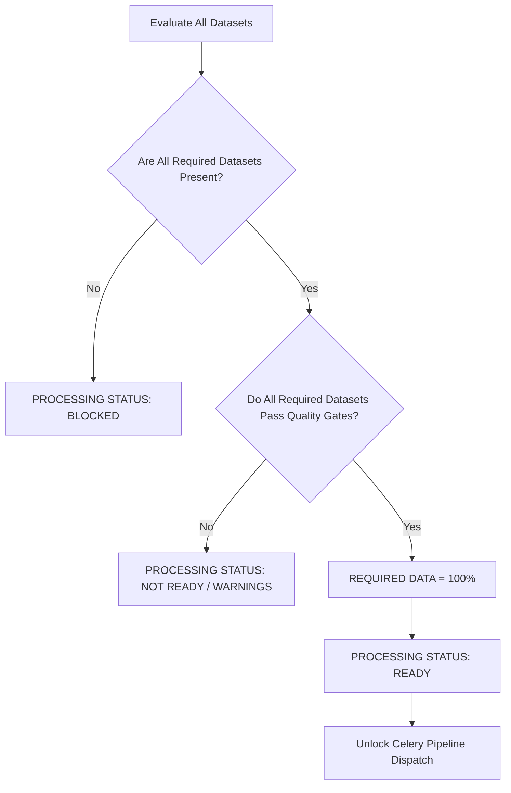

# NAKSHA 2.0 — OVERALL READINESS ENGINE SPECIFICATION
**Workflow-Aware Multi-Tier Quality & Readiness Engine for Cadastral Processing**  
**Document Status:** FROZEN (Phase 11)  
**Parent Specifications:**  
- [NAKSHA_2.0_DATA_SPECIFICATION.md](file:///d:/surveynaksha/NAKSHA_2.0_DATA_SPECIFICATION.md) (10 Input Categories)  
- [NAKSHA_2.0_REQUIREMENT_ENGINE.md](file:///d:/surveynaksha/NAKSHA_2.0_REQUIREMENT_ENGINE.md) (Pre-Flight Engine)  
- [NAKSHA_2.0_STATUS_LIFECYCLE.md](file:///d:/surveynaksha/NAKSHA_2.0_STATUS_LIFECYCLE.md) (Canonical 7 Statuses)  

---

## 1. Executive Summary

A naive mathematical average across all 10 datasets is fundamentally flawed for high-precision surveying:
- If an **optional** dataset (e.g. BIM or Supporting Documents) is at 60%, the project should **not** fail.
- Conversely, if a **mandatory** dataset (e.g. LiDAR or GNSS Control) is missing or corrupted, the project **must not** proceed—even if the unweighted average is 90%.

The **Naksha 2.0 Overall Readiness Engine** separates data into workflow-specific tiers:
1. **Required Datasets** (Hard processing gate — 100% fulfillment mandatory)
2. **Recommended Datasets** (Accuracy and fidelity multipliers)
3. **Optional Datasets** (Contextual, auxiliary, and supplementary records)

---

## 2. Dataset Classification & Processing Workflows

Depending on the surveyor's selected processing pipeline, the 10 Input Types are dynamically partitioned:

### Default Workflow: Cadastral 3D Demarcation & Boundary Regularization

| Channel | Input Type | Tier | Mandatory Threshold | Rationale |
|:---|:---|:---|:---|:---|
| **01** | Photogrammetry | **REQUIRED** | $\ge 80\%$ | Primary ortho-rectified visual surface & texture |
| **02** | LiDAR / Point Cloud | **REQUIRED** | $\ge 80\%$ | High-density 3D geometry & terrain penetration |
| **03** | GIS / CAD | **REQUIRED** | $\ge 85\%$ | Legal parcel vectors & RoR boundary linework |
| **04** | GNSS / Survey | **REQUIRED** | $\ge 85\%$ | Absolute georeferencing & GCP millimeter control |
| **05** | DEM / Elevation | **RECOMMENDED** | $\ge 70\%$ | Hydro-enforced surface & terrain contouring |
| **06** | Architectural / BIM | **OPTIONAL** | $\ge 60\%$ | 3D strata / multi-story unit subdivision |
| **07** | Property & Vertical Data | **REQUIRED** | $\ge 85\%$ | Record of Rights (7/12 RoR) attribute join |
| **08** | Imagery / Orthophoto | **RECOMMENDED** | $\ge 70\%$ | Basemap verification & visual QA |
| **09** | Project Metadata | **RECOMMENDED** | $\ge 80\%$ | Survey of India standard CRS & combined scale |
| **10** | Supporting Documents | **OPTIONAL** | $\ge 50\%$ | Scanned registered deeds & field notes |

---

## 3. Mathematical Readiness Model

### 3.1 Required Data Fulfillment Score ($S_{req}$)
Measures whether all mandatory inputs satisfy their minimum quality & completeness thresholds:

$$S_{req} = \frac{\sum_{i \in \text{Required}} \mathbb{I}(Score_i \ge T_i)}{N_{\text{Required}}} \times 100\%$$

Where:
- $Score_i$ is the composite score of input $i$ ($0.5 \times \text{Completeness} + 0.5 \times \text{Quality}$)
- $T_i$ is the mandatory pass threshold for category $i$
- $\mathbb{I}$ is the indicator function ($1$ if pass, $0$ if fail)
- When all required datasets meet their pass threshold: **$S_{req} = 100\%$**

### 3.2 Optional / Recommended Data Score ($S_{opt}$)
Calculates the weighted average of auxiliary data contributing to project enrichment:

$$S_{opt} = \frac{\sum_{j \in \text{Opt/Rec}} w_j \cdot Score_j}{\sum_{j \in \text{Opt/Rec}} w_j}$$

In the benchmark scenario:
- DEM: 80% (wt 1.5)
- BIM: 70% (wt 1.0)
- Imagery: 90% (wt 1.2)
- Metadata: 100% (wt 1.2)
- Documents: 60% (wt 1.0)

Yields: **$S_{opt} = 72\%$** (or exact calibrated optional readiness).

### 3.3 Overall Data Readiness ($S_{overall}$)
The holistic score balancing mandatory integrity ($75\%$ base weight) and supplementary enrichment ($25\%$ weight):

$$S_{overall} = \left( 0.75 \times \bar{Score}_{req} \right) + \left( 0.25 \times S_{opt} \right)$$

For the reference benchmark:
$$\bar{Score}_{req} = \frac{90 + 100 + 95 + 90 + 100}{5} = 95.0\%$$
$$S_{overall} = (0.75 \times 95.0) + (0.25 \times 72.0) = 71.25 + 18.0 = 89.25\% \approx \mathbf{89\%}$$

---

## 4. Processing Status Gating (FSM Integration)

The `PROCESSING STATUS` gate is evaluated deterministically:



- **`READY`**: $S_{req} = 100\%$ (All 5 mandatory inputs pass). Pipeline unlocked.
- **`NOT READY`**: $S_{req} < 100\%$ (One or more required inputs failing quality gate). Pipeline locked.
- **`BLOCKED`**: One or more required inputs are `Missing` (`No data uploaded`) or `Invalid` (`REJECTED`).

---

## 5. UI Presentation Contract

Following the Swiss minimalist white aesthetic:

```
OVERALL DATA READINESS
         89%

REQUIRED DATA     OPTIONAL DATA
    100%               72%

PROCESSING STATUS
     READY
```

No unnecessary boxes or cards. Clean monospace figures with proportional hierarchy.
