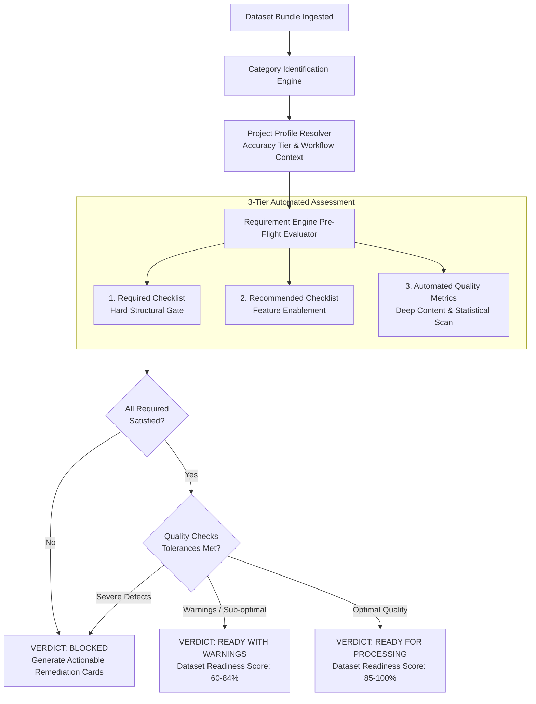

# NAKSHA 2.0 — DATA REQUIREMENT ENGINE SPECIFICATION
**Automated Dataset Pre-Flight Validation, Quality Assessment, and Processing Readiness Engine**  
**Document Status:** FROZEN (Phase 1)  
**Parent Specification:** [NAKSHA_2.0_DATA_SPECIFICATION.md](file:///d:/surveynaksha/NAKSHA_2.0_DATA_SPECIFICATION.md)  
**Target Platform:** Naksha 2.0 Core Processing Pipeline & Quality Control Subsystem  

---

## 1. Executive Concept & Philosophy

### 1.1 The Shift from File Ingestion to Processing Readiness
In traditional geospatial software, ingestion answers a superficial question:
> *"Did the user upload a file with an acceptable extension?"*

In Naksha 2.0, the **Data Requirement Engine** answers the engineering question:
> *"Does this dataset satisfy the mathematical, topological, spatial, and radiometrical requirements to successfully execute the target processing workflow at the requested accuracy standard?"*

```
┌────────────────────────────────────────────────────────────────────────┐
│                   NAKSHA 2.0 REQUIREMENT EVALUATION                    │
│                                                                        │
│   ❌ PASSIVE INGESTION: File uploaded (.las) ➔ Trigger pipeline       │
│                         ➔ Pipeline crashes at 87% due to missing CRS.  │
│                                                                        │
│   ✅ REQUIREMENT ENGINE: Inspect bundle ➔ Validate XYZ + SRS           │
│                          ➔ Calculate point density & noise %           │
│                          ➔ Verify vertical datum ➔ Generate Readiness  │
│                          Score (94/100) ➔ Gate to Pipeline.            │
└────────────────────────────────────────────────────────────────────────┘
```

### 1.2 Evaluation Verdict Hierarchy
Every incoming dataset is evaluated against its category's **Requirement Profile**. The evaluation outputs three distinct signal levels:

1. **`REQUIRED` (Hard Blockers / Pre-Flight Gate):**
   - Critical prerequisites. If missing or invalid, processing **cannot proceed**.
   - Dataset Status: `BLOCKED`. Pipeline execution is disabled with clear remediation guidance.
2. **`RECOMMENDED` (Soft Prerequisites / Feature Enablers):**
   - Attributes that enrich output quality, speed up convergence, or unlock optional features (e.g. RGB colorization in LiDAR or true ground RTK in photogrammetry).
   - Dataset Status: `WARNING_ACCEPTABLE`. Processing is allowed; fallbacks are engaged.
3. **`QUALITY CHECKS` (Quantitative Verification Metrics):**
   - Automated numeric and heuristic checks run across data payloads (density, blur, overlap, slivers, voids, vertical offsets, coordinate bounds).
   - Produces a **Dataset Quality Score ($Q_s \in [0, 100]$)**.

---

## 2. Requirement Engine Architecture & Execution Flow



### 2.1 The Project-Aware Accuracy Tier System
Requirements are not static; they adapt dynamically based on the project's declared **Accuracy Tier**:

| Accuracy Tier | Target Horizontal RMSE | Target Vertical RMSE | Primary Use Case |
|---|---|---|---|
| **Tier 1: Cadastral Legal** | $\le 2.0\text{ cm}$ | $\le 3.0\text{ cm}$ | Revenue land demarcation, legal title disputes, urban master plans |
| **Tier 2: Engineering Grade** | $\le 5.0\text{ cm}$ | $\le 7.0\text{ cm}$ | Highway alignment, railway grade, irrigation, pipeline engineering |
| **Tier 3: Topographic Recon** | $\le 20.0\text{ cm}$ | $\le 30.0\text{ cm}$ | Regional contouring, watershed modeling, forestry, mining volume |

---

## 3. Requirement Profiles for All 10 Input Categories

---

### Profile 01: Photogrammetry

Target Workflows: *Structure-from-Motion (SfM), Dense Multi-View Stereo, Orthomosaic Stitching, Digital Surface Model Generation.*

#### 1. Required (Hard Blockers)
- [x] **Image Payload:** Minimum of 10 optical frames with valid EXIF headers (minimum 3 for micro-inspections).
- [x] **Coordinate / Geolocation Information:** Embedded EXIF GPS tags (Lat, Lon, Alt) OR external trajectory log (`.pos`, `.csv`).
- [x] **Camera Calibration Metadata:** Known sensor dimensions, focal length, or pixel pitch (from EXIF MakerNote or accompanying `camera.csv`).
- [x] **Homogeneous Spectral Type:** All frames in the block must belong to the same camera payload (no mixing RGB with thermal/multispectral in a single pass).

#### 2. Recommended (Feature Enablers)
- [ ] **High-Precision RTK/PPK Trajectory:** Shutter synchronization file (`.mrk`) and base station observation for centimeter-accurate camera centers without extensive GCPs.
- [ ] **Ground Control Points (GCPs):** Independent survey-measured marks for external absolute orientation and bundle adjustment constraint.
- [ ] **Flight Plan Sidecar:** JSON/XML flight plan specifying forward overlap %, sidelap %, and planned AGL (Above Ground Level).
- [ ] **RAW/DNG Optical Negatives:** Uncompressed 12/14-bit Bayer sensor data for maximum dynamic range and shadow recovery.

#### 3. Quality Checks & Verification Metrics
| Check Name | Metric / Algorithm | Pass Criteria | Warning Threshold | Block / Failure Condition |
|---|---|---|---|---|
| **File Readability** | Byte-level header and JPEG/TIFF stream validation | 100% readable | — | Any corrupt or truncated image |
| **Forward & Sidelap** | Spatial footprint intersection calculation | Forward $\ge 75\%$, Sidelap $\ge 65\%$ | Forward $65\text{--}74\%$, Sidelap $50\text{--}64\%$ | Forward $< 65\%$ or Sidelap $< 50\%$ (Causes reconstruction gaps) |
| **Blur / Sharpness** | Modified Laplacian Variance ($V_{lap}$) across image grid | $V_{lap} \ge 120$ | $80 \le V_{lap} < 120$ | $V_{lap} < 80$ on $> 10\%$ of frames (Motion blur) |
| **Exposure / Radiometry**| Histogram clipping check (dark $< 5$, highlight $> 250$) | Saturated pixels $< 2\%$ | Saturated pixels $2\text{--}8\%$ | Saturated pixels $> 8\%$ (Severe over/underexposure) |
| **GSD Consistency** | Standard deviation of Ground Sampling Distance | $\sigma_{GSD} \le 15\%$ | $15\% < \sigma_{GSD} \le 30\%$ | $\sigma_{GSD} > 30\%$ (Inconsistent flight altitude) |
| **Trajectory Continuity**| Delta time vs. delta distance vector analysis | Smooth flight line | Minor GPS drift ($< 2\text{m}$) | Teleportation / 0,0 GPS coordinates |

---

### Profile 02: LiDAR / Point Cloud

Target Workflows: *Bare-Earth DTM Extraction, Canopy Height Modeling, As-Built vs. BIM Clash Detection, Powerline Inspection, 3D Mesh Generation.*

#### 1. Required (Hard Blockers)
- [x] **Valid Point Cloud Container:** Standard LAS (1.2–1.4), LAZ, E57, or structured PLY file.
- [x] **Coordinate Reference System (CRS):** Declared EPSG code or valid WKT string in LAS VLR header or companion `.prj`.
- [x] **XYZ Coordinates:** Populated, non-zero 3D spatial coordinates with valid scale factors and offsets.
- [x] **Valid Bounding Box:** Min/Max extents declared in header must match actual scanned point envelope within $0.001\text{m}$.

#### 2. Recommended (Feature Enablers)
- [ ] **ASPRS Classification:** Pre-classified returns (Class 2: Ground, Class 3–5: Vegetation, Class 6: Building). Unlocks immediate terrain modeling.
- [ ] **True Color (RGB):** Calibrated red, green, blue color channels (8-bit or 16-bit) per point for photorealistic visualization.
- [ ] **Calibrated Intensity:** Normalized reflection intensity values for surface material differentiation.
- [ ] **GPS Time:** Standard Adjusted GPS Time ($> 10^9$) per point to enable trajectory correlation and strip adjustment.
- [ ] **Return Number & Number of Returns:** Multi-return pulse breakdown (First, Intermediate, Last return) for foliage penetration analysis.

#### 3. Quality Checks & Verification Metrics
| Check Name | Metric / Algorithm | Pass Criteria | Warning Threshold | Block / Failure Condition |
|---|---|---|---|---|
| **Header vs Data Count**| Header point count vs. physical record byte stream | Exact match | — | Record count mismatch / Truncated EOF |
| **Coordinate Sanity** | Detect false 0,0,0 points or astronomical coordinates | $0\%$ invalid coordinates | Invalid points $< 0.01\%$ | Invalid / NaN coordinates $> 0.01\%$ |
| **Point Density** | Points per square meter ($pts/m^2$) on $10\text{m} \times 10\text{m}$ grid | $\ge 15\ pts/m^2$ (Tier 1/2) | $5\text{--}14\ pts/m^2$ | $< 5\ pts/m^2$ (Insufficient for engineering DTM) |
| **Noise Percentage** | Outlier distance clustering (SOR filter, $k=20, \sigma=3.0$) | Noise points $< 0.1\%$ | $0.1\%\text{--}1.0\%$ | Noise points $> 1.0\%$ (Airborne bird/dust artifacts) |
| **Swath Overlap Alignment**| Relative vertical offset between overlapping scan strips | $dZ \le 0.03\text{m}$ | $0.03\text{m} < dZ \le 0.08\text{m}$ | $dZ > 0.08\text{m}$ (Strip separation / IMU drift) |
| **Precision Scale Factor**| Header scale factor ($x, y, z$ quantum step) | $\le 0.001\text{m}$ | $0.005\text{m}$ | Scale $> 0.01\text{m}$ (Coarse precision quantization) |

---

### Profile 03: GIS / CAD

Target Workflows: *Cadastral Boundary Resolution, Encroachment Analysis, Master Plan Overlays, Topological Partitioning, Volume Boundary Clipping.*

#### 1. Required (Hard Blockers)
- [x] **Complete File Quad-Set (Shapefiles):** Mandatory coexistence of `.shp` (geometry), `.shx` (index), and `.dbf` (attribute database).
- [x] **Spatial Reference (CRS):** Accompanying `.prj` file with standard OGC WKT or valid internal GeoPackage spatial metadata.
- [x] **Valid Geometry Primitives:** Polygons, lines, and points must conform to OGC Simple Features Specification.
- [x] **Resolved External References (CAD):** In DWG/DXF files, all referenced XREFs must be packaged or embedded.

#### 2. Recommended (Feature Enablers)
- [ ] **Unique Parcel Identifier (UPI / Khasra No):** Dedicated, non-null attribute column identifying each spatial unit.
- [ ] **Character Code Page (`.cpg`):** Explicit encoding definition (UTF-8, ISO-8859-1, or Regional Indic) preventing text corruption.
- [ ] **Symbology & Styling:** Companion `.sld`, `.qml`, or `.ctb` style table for standardized rendering.
- [ ] **Clean Layer Structure (CAD):** Strict separation of boundaries, annotation text, contours, and survey marks into isolated layers.

#### 3. Quality Checks & Verification Metrics
| Check Name | Metric / Algorithm | Pass Criteria | Warning Threshold | Block / Failure Condition |
|---|---|---|---|---|
| **Self-Intersection** | OGC `ST_IsValid()` check for bowtie polygons and twisted rings | 0 invalid geometries | Validated with auto-repair | Unrepairable self-intersections |
| **Slivers & Micro-Gaps**| Detect unshared polygon boundaries with gap width $< 0.05\text{m}$ | 0 sliver polygons | Sliver area $< 0.05\%$ of total | Extensive sliver clusters (bad digitization) |
| **Duplicate Vertices**| Vertex proximity test ($\Delta D < 0.001\text{m}$) along perimeter | 0 redundant vertices | $< 1\%$ redundant vertices | Redundant vertices $> 5\%$ |
| **Unit Scaling Sanity**| Dimension validation (detect mm vs m vs US Survey Feet) | Polygon areas match expected cadastre | Factor of 1000 mismatch (mm) | Coordinates off by $> 100\text{km}$ from project CRS |
| **Attribute Completeness**| Primary key null check on parcel/feature identifier | $100\%$ populated | $95\text{--}99\%$ populated | $> 5\%$ null primary attributes |

---

### Profile 04: GNSS / Survey

Target Workflows: *GCP Georeferencing, Checkpoint Accuracy Verification, Baseline Kinematic Post-Processing, Boundary Monumentation.*

#### 1. Required (Hard Blockers)
- [x] **Survey Coordinate Table:** Clear tabular columns: `Point_ID`, `X/Easting`, `Y/Northing`, `Z/Elevation`.
- [x] **Declared Coordinate Reference System:** Explicit target datum and projection (e.g. WGS84 UTM Zone 43N or Local State Plane).
- [x] **RINEX Pair (if raw GNSS):** Both Observation file (`.obs`/`.*o`) and Navigation ephemeris (`.nav`/`.*n`) must be present.
- [x] **Point Role Classification:** Every record must be tagged as a **Ground Control Point (GCP)** or an independent **Check Point (CP)**.

#### 2. Recommended (Feature Enablers)
- [ ] **Quality & Standard Deviations:** Inclusion of $1\sigma$ positional precision columns ($\sigma_X, \sigma_Y, \sigma_Z$).
- [ ] **Antenna Calibration Profile:** Antenna model, NGS code, and height measurement method (true vertical vs. slant height).
- [ ] **Field Monument Verification Photos:** Scanned ground sketches or photos confirming mark recovery.
- [ ] **Base Station Coordinates:** Published CORS network coordinates or high-accuracy autonomous static base solution.

#### 3. Quality Checks & Verification Metrics
| Check Name | Metric / Algorithm | Pass Criteria | Warning Threshold | Block / Failure Condition |
|---|---|---|---|---|
| **Coordinate Sanity** | Point coordinates fall inside the defined project spatial bounding box | $100\%$ within AOI | Points within $500\text{m}$ buffer | Points located thousands of km outside AOI |
| **Positional Precision**| Horizontal standard deviation ($\sigma_{XY}$) from RTK log | $\sigma_{XY} \le 0.015\text{m}$ | $0.015\text{m} < \sigma_{XY} \le 0.03\text{m}$| $\sigma_{XY} > 0.05\text{m}$ (Float solution / Multipath) |
| **Vertical Precision** | Vertical standard deviation ($\sigma_Z$) from RTK log | $\sigma_Z \le 0.025\text{m}$ | $0.025\text{m} < \sigma_Z \le 0.05\text{m}$ | $\sigma_Z > 0.08\text{m}$ |
| **PDOP / Satellite Count**| Dilution of Precision and visible constellation tracking | $\text{PDOP} \le 2.0$, Sats $\ge 18$ | $2.0 < \text{PDOP} \le 3.5$ | $\text{PDOP} > 4.0$, Sats $< 8$ |
| **GCP Distribution** | Convex hull spatial distribution across project boundary | Points on perimeter + center | Slight clustering | All points along a single straight line (collinear) |

---

### Profile 05: DEM / Elevation

Target Workflows: *Hydrological Runoff Modeling, Cut-and-Fill Earthworks, Contour Vectorization, Slope/Aspect Hazard Mapping.*

#### 1. Required (Hard Blockers)
- [x] **Single-Band Float Raster:** GeoTIFF or ASCII Grid with single-band 32-bit floating point or 16-bit integer elevation values.
- [x] **Georeferencing Metadata:** Raster transform matrix (origin coordinates + pixel size $dX, dY$) embedded in GeoTIFF or companion `.tfw`.
- [x] **Defined Coordinate System:** Valid horizontal projection (EPSG) and explicit vertical datum.
- [x] **Explicit No-Data Tag:** Standard declared no-data marker (e.g., `-9999`, `-32767`, or IEEE `NaN`).

#### 2. Recommended (Feature Enablers)
- [ ] **Vertical Datum Declaration:** Explicit identification of vertical datum (e.g. EGM2008 Geoid vs WGS84 Ellipsoid vs Indian MSL).
- [ ] **Cloud Optimized GeoTIFF (COG):** Internal tiling (256x256) with power-of-two decimation pyramids for rapid viewport streaming.
- [ ] **Hydro-Flattening Breaklines:** Vector polylines marking waterbodies and streams to enforce downward water flow.
- [ ] **Surface Statistics Sidecar:** Precomputed `.aux.xml` with minimum, maximum, mean, and standard deviation elevations.

#### 3. Quality Checks & Verification Metrics
| Check Name | Metric / Algorithm | Pass Criteria | Warning Threshold | Block / Failure Condition |
|---|---|---|---|---|
| **Void / No-Data Area**| Percentage of no-data pixels inside the active project boundary | $\le 0.5\%$ | $0.5\%\text{--}3.0\%$ | $> 3.0\%$ unclipped holes inside surveyed area |
| **Elevation Range Sanity**| Absolute min/max values against regional physical limits | Within realistic bounds | Local elevation jump $30\text{--}50\text{m}$ | Negative or $8000\text{m}+$ values in lowland plains |
| **Spike / Pit Artifacts**| Laplacian edge filter detecting single-pixel elevation spikes | 0 severe spikes | Isolated spikes $< 5$ per $km^2$| Extensive spike clusters (unfiltered trees/noise) |
| **Resolution Uniformity**| Absolute pixel aspect ratio difference $|dX| - |dY|$ | $|dX - dY| \le 0.0001\text{m}$ | Minor anisotropic pixel | Non-square pixels ($> 5\%$ difference) |

---

### Profile 06: Architectural / BIM

Target Workflows: *Site Spatial Alignment, 3D Cadastral Unit Subdivision, Underground Utility Clash Detection, Infrastructure As-Built Audit.*

#### 1. Required (Hard Blockers)
- [x] **Valid BIM Schema:** Conforming IFC standard (`IFC2x3`, `IFC4`, `IFC4x3`) or valid Revit/DWG 3D structural model.
- [x] **Spatial Unit Specification:** Explicit declaration of dimensional units (Millimeters, Centimeters, or Meters).
- [x] **Structural Integrity:** At least one closed solid geometric volume representing a physical building element (`IfcWall`, `IfcSlab`, `IfcColumn`).

#### 2. Recommended (Feature Enablers)
- [ ] **Georeferencing Transformation Matrix:** `IfcMapConversion` or translation vector $[X_0, Y_0, Z_0]$ and rotation angle $\theta$ mapping the model to site CRS.
- [ ] **Spatial Containment Tree:** Fully structured `IfcProject` $\rightarrow$ `IfcSite` $\rightarrow$ `IfcBuilding` $\rightarrow$ `IfcBuildingStorey` $\rightarrow$ `IfcSpace`.
- [ ] **Property Sets (Psets):** Attached attributes (`Pset_WallCommon`, `Pset_SpaceCommon`, unit numbers, ownership classifications).
- [ ] **BCF Issue Tracker:** BIM Collaboration Format (`.bcfzip`) file capturing known structural or boundary discrepancies.

#### 3. Quality Checks & Verification Metrics
| Check Name | Metric / Algorithm | Pass Criteria | Warning Threshold | Block / Failure Condition |
|---|---|---|---|---|
| **Coordinate Offset Check**| Distance of model origin $(0,0,0)$ from project geographic site | Within $50\text{m}$ of site | Floating at $0,0,0$ with translation sidecar | Floating at $0,0,0$ without any georeferencing matrix |
| **Geometric Clashes**| Hard clash intersection between primary structural solids | 0 critical clashes | Minor non-structural overlaps | Unresolvable interpenetrations |
| **Inverted Normals**| Face normal direction of 3D polygonal boundaries | $100\%$ outward facing | Auto-flipping successful | Non-manifold / self-intersecting meshes |
| **Floor Level Alignment**| Storey elevations ($Z$) relative to ground DTM surface | Ground floor sits on DTM | Elevation offset $0.1\text{--}0.5\text{m}$ | Model floating in air or buried underground |

---

### Profile 07: Property & Vertical Data

Target Workflows: *3D Land Administration (LADM ISO 19152), Mutation Record Audit, Encroachment Settlement, Title Verification.*

#### 1. Required (Hard Blockers)
- [x] **Unique Parcel Key:** Column containing unique land parcel identifiers matching the GIS/CAD layer (e.g. Survey Number, Khasra, Gat No).
- [x] **Ownership Ledger:** Clear owner names, legal share percentages, and tenure types.
- [x] **Recorded Legal Area:** Explicit declared area column with declared measurement unit (Hectares, Acres, Sq. Meters, Guntha).

#### 2. Recommended (Feature Enablers)
- [ ] **Vertical 3D Unit Schedules:** Breakdown of multi-storey properties (Floor number, Apartment number, Carpet area, Balcony area, Share of undivided land).
- [ ] **Mutation Entry History:** Historical transaction logs detailing prior ownership transitions and mortgage charges.
- [ ] **Georeferenced Cadastral Tie:** Cross-reference to village tippan, sheet number, or boundary demarcation certificate.
- [ ] **Verified Registered Deeds:** Accompanying PDF copies of registered sale deeds matching the parcel identifiers.

#### 3. Quality Checks & Verification Metrics
| Check Name | Metric / Algorithm | Pass Criteria | Warning Threshold | Block / Failure Condition |
|---|---|---|---|---|
| **Spatial Key Join Rate**| Percentage of tabular records resolving to a polygon in GIS/CAD | $100\%$ join resolution | $95\text{--}99\%$ join resolution | Join rate $< 90\%$ (Orphaned ownership records) |
| **Legal vs Survey Area**| Computed GIS polygon area ($A_{gis}$) vs. Legal recorded area ($A_{doc}$) | $|\Delta A| \le 1.0\%$ | $1.0\% < |\Delta A| \le 3.0\%$ | $|\Delta A| > 3.0\%$ (Potential encroachment or false deed) |
| **Sum of Shares Check** | Verification that fractional shares for a co-owned parcel equal $1.0$ | $\sum \text{Share} = 1.000$ | Rounding delta $\le 0.005$ | $\sum \text{Share} \neq 1.0$ (Title dispute / Over-allocation) |
| **Duplicate Record Check**| Audit for identical parcel entries with conflicting owners | 0 duplicate records | — | Duplicate unresolved records |

---

### Profile 08: Imagery / Orthophoto

Target Workflows: *Visual Basemap Integration, AI Feature Extraction (Building Footprints, Roads), Change Detection, Cadastral Boundary Superimposition.*

#### 1. Required (Hard Blockers)
- [x] **Georeferenced Raster Container:** Valid GeoTIFF / COG OR standard raster (`.jpg`, `.png`) accompanied by world file (`.tfw`, `.jgw`) and `.prj`.
- [x] **Defined Spatial Projection:** Declared EPSG projection matching project coordinate space.
- [x] **Visual Spectral Bands:** Minimum 3 color channels (RGB) or single-band panchromatic.

#### 2. Recommended (Feature Enablers)
- [ ] **Cloud Optimized GeoTIFF (COG):** Standard internal tile structure (256x256 or 512x512) and overviews for high-speed streaming.
- [ ] **Near-Infrared (NIR) Band:** 4th spectral band (RGB + NIR) enabling automated NDVI vegetation classification.
- [ ] **Alpha Transparency Mask:** Dedicated 4th/5th channel masking black/nodata image borders.
- [ ] **Tile Index Register:** Companion GeoJSON/Shapefile index if orthomosaic is delivered in multiple mosaic sheets.

#### 3. Quality Checks & Verification Metrics
| Check Name | Metric / Algorithm | Pass Criteria | Warning Threshold | Block / Failure Condition |
|---|---|---|---|---|
| **Absolute Georeference**| Cross-check raster alignment against GNSS control checkpoints | $\text{RMSE}_{xy} \le 1.5 \times \text{GSD}$ | $1.5\text{--}2.5 \times \text{GSD}$ | $\text{RMSE}_{xy} > 3.0 \times \text{GSD}$ (Planar shift) |
| **Radiometric Saturation**| Pixel intensity distribution across all active bands | Clipping $< 1\%$ | Clipping $1\text{--}5\%$ | Clipping $> 5\%$ (Blown-out white concrete/water) |
| **Seamline Discontinuity**| Edge gradient detection across orthophoto mosaic seamlines | Invisible seamlines | Minor color shift | Abrupt geometric offset at seamline |
| **Cloud / Shadow Obstruction**| AI cloud and cast-shadow detection mask | $0\%$ cloud cover | Cover $< 0.5\%$ | Cloud cover $> 1.0\%$ across survey area |

---

### Profile 09: Project / Metadata

Target Workflows: *Audit Trail Generation, Legal Admissibility Packaging, Multi-Party Project Exchange, Regulatory Archival.*

#### 1. Required (Hard Blockers)
- [x] **Project Identity Manifest:** JSON or XML document specifying Project Name, Unique Project ID, Client, and Execution Organization.
- [x] **Defined Geographic Datum:** Declared horizontal datum, projection system, and central meridian.
- [x] **Survey Execution Window:** Declared start and completion timestamps (ISO 8601).

#### 2. Recommended (Feature Enablers)
- [ ] **Combined Scale Factor (CSF):** Declared ground-to-grid scale factor and mean site elevation for true ground distance reduction.
- [ ] **Equipment Calibration Certificates:** Serial numbers, calibration dates, and calibration certificates for UAVs, LiDAR, and GNSS receivers.
- [ ] **Surveyor Credentials:** Official license number, Survey of India / Professional Surveyor accreditation, and digital signature hash.
- [ ] **Project Area of Interest (AOI):** Closed boundary polygon defining the contractual survey limits.

#### 3. Quality Checks & Verification Metrics
| Check Name | Metric / Algorithm | Pass Criteria | Warning Threshold | Block / Failure Condition |
|---|---|---|---|---|
| **Schema Conformance** | Strict validation against Naksha 2.0 Manifest JSONSchema | $100\%$ valid | — | Corrupted syntax or missing mandatory tags |
| **Spatial Bounding Check**| Project AOI intersects the spatial extents of all uploaded datasets | $100\%$ overlap | AOI covers $> 90\%$ of data | Zero intersection (Metadata belongs to wrong project) |
| **Temporal Consistency**| Survey timestamps in manifest match EXIF and GNSS log times | Temporal match | Clock drift $< 24\text{ hours}$| Survey date in future or discrepancies $> 30\text{ days}$ |

---

### Profile 10: Supporting Documents

Target Workflows: *Legal Evidence Linking, Boundary Recovery, Municipal Approvals, Historical Baseline Reconciliation.*

#### 1. Required (Hard Blockers)
- [x] **Clean Non-Corrupt Binary:** Readable document format (`.pdf`, `.docx`, `.xlsx`, `.jpg`, `.png`).
- [x] **Context Tagging:** Every document must be explicitly tagged to a Project, a Parcel ID, or a Survey Station.

#### 2. Recommended (Feature Enablers)
- [ ] **Searchable OCR Layer:** Pre-extracted or embedded optical character recognition text inside scanned PDF deeds and sketches.
- [ ] **Document Taxonomy Classification:** Categorized as: `Title Deed`, `Government Gazette`, `Recovery Sketch`, `NOC`, `Mutation Form`.
- [ ] **High-Resolution Scanning:** Scans rendered at $\ge 300\text{ DPI}$ with balanced contrast for legal archival.

#### 3. Quality Checks & Verification Metrics
| Check Name | Metric / Algorithm | Pass Criteria | Warning Threshold | Block / Failure Condition |
|---|---|---|---|---|
| **Malware & Security Scan**| Binary inspection for malicious macro scripts or shell exploits | Clean | — | Threat detected / Ingestion rejected |
| **Password Encryption** | PDF document encryption status | Unlocked / Readable | — | Password-protected without credentials |
| **Visual Legibility** | Contrast ratio and minimum DPI detection on scanned pages | $\ge 200\text{ DPI}$, Contrast $\ge 4.5:1$| $150\text{--}199\text{ DPI}$ | $< 150\text{ DPI}$ (Unreadable low-res photo of deed) |

---

## 4. Master Requirement Engine Verification Matrix

| # | Category | Core Required Gate | Key Recommended | Critical Automated Quality Checks |
|---|---|---|---|---|
| **01** | **Photogrammetry** | $\ge 10$ Images, Camera Metadata, EXIF/Trajectory GPS | RTK/PPK `.mrk`, GCPs, Flight Plan | Blur ($V_{lap} \ge 80$), Overlap ($\ge 65\%/50\%$), Exposure |
| **02** | **LiDAR / Point Cloud** | Point Cloud (`.las/.laz`), CRS/SRS, 3D XYZ, Header Box | ASPRS Classification, RGB, GPS Time | Point Density ($\ge 5\ pts/m^2$), Zero-point check, Noise $\%$ |
| **03** | **GIS / CAD** | Complete Quad-Set (`.shp/.shx/.dbf`), CRS, OGC Geometry | UPI / Parcel Key, `.cpg` Encoding, Styles | Self-intersections (`ST_IsValid`), Slivers, Duplicate Vertices |
| **04** | **GNSS / Survey** | XYZ Coordinates, Target Datum, Role (GCP vs CP) | $1\sigma$ Precision, Antenna height, Base logs | Coordinate Sanity in AOI, $\sigma_{xy} \le 0.03\text{m}$, PDOP $\le 3.5$ |
| **05** | **DEM / Elevation** | 32-bit Float Raster, Transform Matrix, CRS, No-Data | Vertical Datum (EGM2008), COG, Breaklines | Void $\% \le 3\%$, Spike/Pit filtering, Elevation range sanity |
| **06** | **Architectural / BIM** | Valid IFC/Revit/DWG, Unit Declaration, 3D Solids | Georeference Matrix, Spatial Containment Tree | Distance from site $\le 50\text{m}$, Solid clashes, Inverted normals |
| **07** | **Property & Vertical Data** | Unique Parcel ID, Owner Ledger, Legal Area | 3D Unit Schedule, Mutation History, Deeds | Key Join Rate $\ge 90\%$, Legal vs GIS Area $\le 3\%$, Share sum |
| **08** | **Imagery / Orthophoto** | Georeferenced Raster, Declared CRS, RGB Channels | COG Tiling, NIR Band, Alpha Border Mask | GCP Alignment RMSE, Seamline jumps, Cloud cover $\le 0.5\%$ |
| **09** | **Project / Metadata** | Project ID, Geodetic Datum, Survey Dates | Combined Scale Factor (CSF), Surveyor Sign-off | JSONSchema validation, AOI spatial intersection, Time sanity |
| **10** | **Supporting Documents** | Clean Document Binary, Linked Context Tag | OCR Text Layer, Taxonomy Tag, $\ge 300\text{ DPI}$ | Security / Virus clean, Password check, Contrast legibility |

---

## 5. Automated Remediation & Surveyor Guidance Engine

When a dataset fails a `REQUIRED` condition or triggers a severe `QUALITY CHECK` breach, the engine does not output a generic error code. It generates an **Actionable Remediation Card**:

```
┌────────────────────────────────────────────────────────────────────────┐
│ ❌ DATASET BLOCKED: LiDAR Substation Survey (Block 04)                │
│                                                                        │
│ Issue Detected:                                                        │
│ • Missing Coordinate Reference System (CRS)                            │
│ • 14,208 points with 0.000, 0.000, 0.000 coordinates                  │
│                                                                        │
│ Impact:                                                                │
│ Cannot compute bare-earth terrain model or align with GIS cadastre.    │
│                                                                        │
│ Surveyor Remediation Actions:                                          │
│ 1. Drop the accompanying projection file (e.g. `EPSG32643.prj`) onto   │
│    this dataset card.                                                  │
│ 2. Enable "Auto-filter Zero Coordinates" in the pre-flight options.    │
│ 3. Click "Re-validate Dataset".                                        │
└────────────────────────────────────────────────────────────────────────┘
```

---

## 6. Implementation Readiness & Phase Gate

This specification is **FROZEN** as the foundational schema for:
- Phase 1: Ingestion Engine & Automated Requirement Engine Service
- Phase 2: [NAKSHA_2.0_DATABASE_DESIGN.md](file:///d:/surveynaksha/NAKSHA_2.0_DATABASE_DESIGN.md) (PostgreSQL + PostGIS & MinIO/S3 Storage Architecture)
- Phase 3: [NAKSHA_2.0_PROJECT_STRUCTURE.md](file:///d:/surveynaksha/NAKSHA_2.0_PROJECT_STRUCTURE.md) (Physical Layout & 10 Input Types Virtualization)
- Phase 4: [NAKSHA_2.0_DESKTOP_SHELL.md](file:///d:/surveynaksha/NAKSHA_2.0_DESKTOP_SHELL.md) (Tauri, React, Tailwind, MapLibre, Three.js, FastAPI & Celery Shell)
- Phase 5: Processing Pipeline Orchestrator & Field QA Engine


