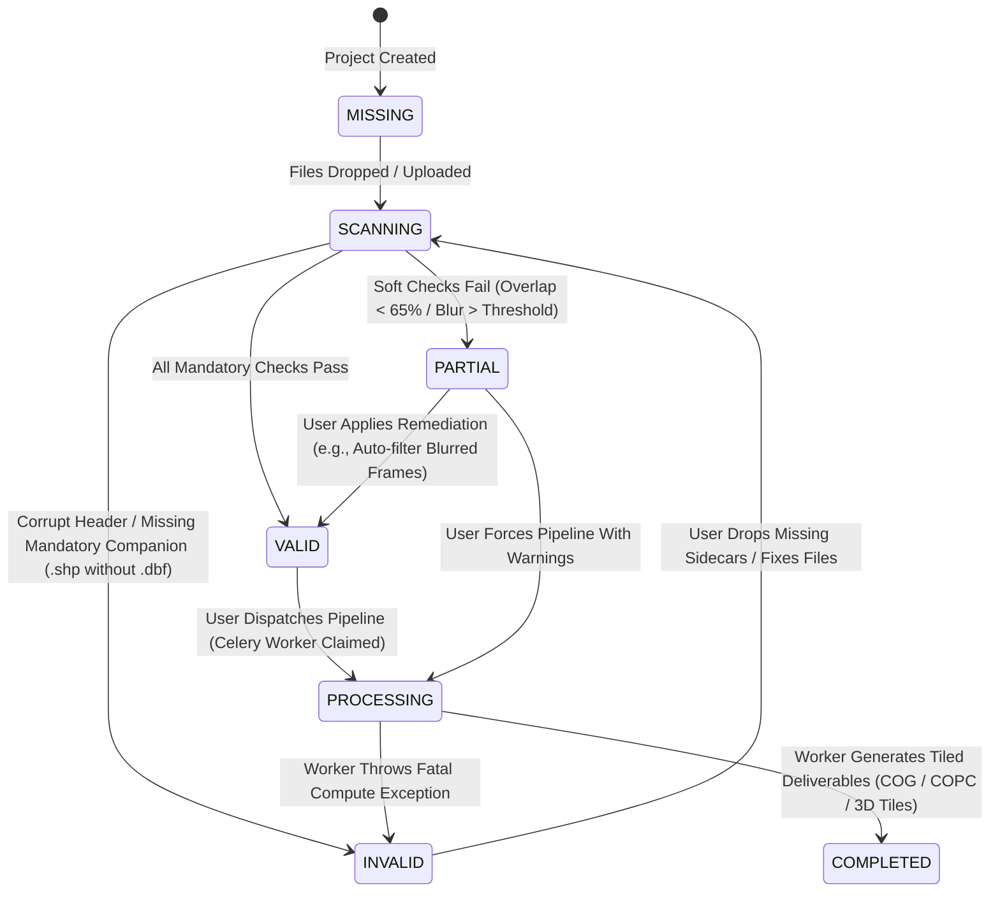

# NAKSHA 2.0 — DATASET STATUS LIFECYCLE SPECIFICATION
**Standard Finite State Machine (FSM) & Status Taxonomy for Geospatial Ingestion**  
**Document Status:** FROZEN (Phase 10)  
**Parent Specifications:**  
- [NAKSHA_2.0_DATA_SPECIFICATION.md](file:///d:/surveynaksha/NAKSHA_2.0_DATA_SPECIFICATION.md) (10 Input Categories)  
- [NAKSHA_2.0_REQUIREMENT_ENGINE.md](file:///d:/surveynaksha/NAKSHA_2.0_REQUIREMENT_ENGINE.md) (Pre-Flight Engine)  
- [NAKSHA_2.0_DATABASE_DESIGN.md](file:///d:/surveynaksha/NAKSHA_2.0_DATABASE_DESIGN.md) (Database & Storage)  

---

## 1. The Canonical 7 Status Definitions

Every dataset in Naksha 2.0 exists in exactly one of the following 7 states:

| Status Key | Semantic State | Exact User Display Label | Trigger & State Definition | UI Color & Styling |
|---|---|---|---|---|
| **`MISSING`** | Missing | `No data uploaded` | 0 files uploaded in this category folder or bucket | Muted Gray (`text-zinc-400`) |
| **`SCANNING`** | Scanning | `Scanning...` | Requirement Engine actively reading headers, calculating blur/overlap | Blue Pulse (`text-blue-500`) |
| **`INVALID`** | Invalid | `REJECTED` | Unrepairable corruption, missing mandatory files, or zero coordinate errors | Rose / Red (`text-rose-600`) |
| **`PARTIAL`** | Partial | `PARTIALLY READY` | Required files present, but soft quality checks fail or recommended items missing | Amber (`text-amber-500`) |
| **`VALID`** | Valid | `READY` | All mandatory requirements pass; completeness & quality meet pipeline standards | Emerald (`text-emerald-600`) |
| **`PROCESSING`**| Processing | `PROCESSING` | Heavy Celery background pipeline currently running compute jobs (SfM, Tiling) | Sky Blue (`text-sky-600`) |
| **`COMPLETED`** | Completed | `COMPLETE` | Processing finished, deliverables (COG, COPC, 3D tiles, cadastral reports) generated | Bold Dark (`text-zinc-900 font-bold`) |

---

## 2. Finite State Machine (FSM) Diagram



---

## 3. Database Schema Mapping (PostgreSQL DDL)

```sql
-- Phase 10 Canonical PostgreSQL ENUM
CREATE TYPE dataset_status_enum AS ENUM (
    'MISSING',       -- Display: "No data uploaded"
    'SCANNING',      -- Display: "Scanning..."
    'INVALID',       -- Display: "REJECTED"
    'PARTIAL',       -- Display: "PARTIALLY READY"
    'VALID',         -- Display: "READY"
    'PROCESSING',    -- Display: "PROCESSING"
    'COMPLETED'      -- Display: "COMPLETE"
);
```

---

## 4. UI Rendering & Client-Side Mapping

```typescript
export type DatasetStatus = 
  | 'MISSING' 
  | 'SCANNING' 
  | 'INVALID' 
  | 'PARTIAL' 
  | 'VALID' 
  | 'PROCESSING' 
  | 'COMPLETED';

export const STATUS_DISPLAY: Record<DatasetStatus, string> = {
  MISSING: 'No data uploaded',
  SCANNING: 'Scanning...',
  INVALID: 'REJECTED',
  PARTIAL: 'PARTIALLY READY',
  VALID: 'READY',
  PROCESSING: 'PROCESSING',
  COMPLETED: 'COMPLETE',
};
```
